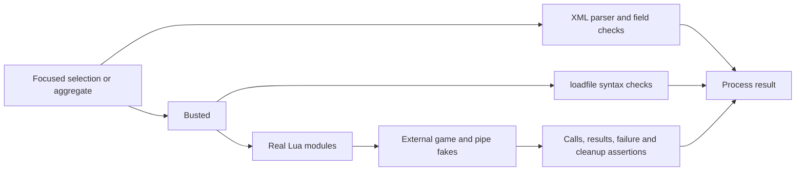

# Quick 260903-32k: Busted migration research

**Researched:** 2026-09-03. **Confidence:** MEDIUM. **Domain:** local Lua/X4 product testing.

<user_constraints>

## User Constraints

The following approved decisions are copied verbatim from CONTEXT.md.
[VERIFIED: 260903-32k-CONTEXT.md, Approved Decisions]

<!-- DATA_b7c28fa1_START -->

### Standard test runner

- Migrate useful existing Lua test scenarios to Busted; remove the custom table-of-functions executor and obsolete tests of that executor.
- Verify and pin a working Windows installation with the existing locked Lua runtime before promising the migration is ready.
- Preserve focused selection, meaningful failures, and a final local product aggregate. Normal small edits must not run unrelated or tool-internal suites.

### Replace analysis with execution

- Remove the custom PowerShell Lua lexer, expression analysis, and import-graph traversal.
- Check Lua syntax through the actual interpreter's loadfile operation without executing the returned chunk.
- Load real Live Galaxy modules using normal Lua require and a deliberate package path. Do not replace internal product modules with permissive fakes.
- Substitute only the external X4 environment: ffi/native functions, required game globals, and the external named-pipe library where actually used. Use standard package.preload and isolate/restore package.loaded and global state.
- Verify expected native calls, arguments, call counts, forbidden calls, results, and failure handling through mocks/spies and executable scenarios. Do not test spelling of ffi.C as a proxy for behavior.
- Cover delayed imports through the scenarios that execute them. A local fake-environment load does not prove all paths or actual X4 runtime compatibility.

### Remaining static checks

- Keep small checks of XML well-formedness, required manifest/UI registration fields, and entrypoint existence using an existing XML parser.
- Remove source-vocabulary bans such as command/model/persistence as behavioral evidence.
- Remove limits on source bytes, graph depth, file count, and import count that exist solely for the deleted analyzer. Preserve actual runtime work, payload, and timing assertions.
- Preserve useful product behavior from removed suites as executable tests where justified; do not preserve tool-internal fixtures merely to retain a test count.

### Instructions and scope

- Update the owning integration/testing instructions only as necessary to express this approved design and remove requirements that would recreate the analyzer. Do not create a new global skill or verification framework.
- Test fakes are small in-process Lua objects, not a PowerShell service or a launched Rust bridge.
- The owner approved this discussion with 'lgtm'. The repository requires a separate approval of the resulting research plus checked implementation plan. Do not interpret discussion approval as permission to bypass that gate.

<!-- DATA_b7c28fa1_END -->

No separate discretion/deferred-ideas sections exist. Runtime/Rust edits, game operation, sibling changes, and Phase 05.1 resumption are excluded; preserve paused RED contracts. Historical numeric behavior remains regression evidence, not future architecture policy. [VERIFIED: 260903-32k-CONTEXT.md, Task Boundary; .planning/HANDOFF.json]

</user_constraints>

## Summary

Use standard Busted specifications and a thin PowerShell aggregate that runs Lua tests and small XML checks. Preserve the useful behavioral scenarios and replace source analysis with actual compilation/loading and external-call expectations. Installation readiness is **not yet proven**: the isolated LuaRocks attempt failed before dependency installation. Plan provisioning first, with a stop on failure; do not remove the current runner until the new runner works. [VERIFIED: research execution; 260903-32k-CONTEXT.md]

## Architectural Responsibility Map

| Capability | Owner | Recommendation/source |
| --- | --- | --- |
| Case discovery, assertions, selection, failure reporting | Busted | Use its normal runner and tags. [CITED: https://lunarmodules.github.io/busted/] |
| Syntax and module resolution | Locked Lua interpreter | Compile with loadfile; execute real modules with require. [CITED: https://www.lua.org/manual/5.1/manual.html] |
| Native/game environment | Small test fakes | Fake only external dependencies; retain real product modules. [VERIFIED: 260903-32k-CONTEXT.md] |
| XML/manifest contracts | Existing .NET XML parser | Keep a small independent check. [VERIFIED: extensions/live_galaxy/tests/x4-package-conformance.ps1:67-76] |

## Project Constraints (from AGENTS.md)

- Keep X4 authoritative; no saves, game control, installed-source edits, live models, or Rust execution in this task. Preserve unrelated changes and paused work.
- Use GSD research, checked planning, owner approval, implementation, review, and verification in order. Record selected/rejected risk gates; use focused tests and one final affected aggregate after fixes converge.
- Bound runtime work and isolate external effects. Never infer X4 compatibility from local fakes or disclose secrets/private data.
- Keep repository artifacts English. Honor the repository Markdownlint ignore for planning files. Update only owning project instructions and changelog; do not patch global skills.
- Main agent owns memory and eventual scoped Git completion; this researcher neither queries memory nor commits.

[VERIFIED: AGENTS.md; .agent-instructions/x4/AGENTS.md; .agent-instructions/x4/MEMORY.md; researcher assignment]

## Standard Stack and Environment Availability

| Item | Pin/status | Evidence and consequence |
| --- | --- | --- |
| Lua | `"archiveVersion": "5.1.5"`, `"executableVersion": "Lua 5.1.5"` | Existing executable ran `-v` successfully. [VERIFIED: tools/lua-runner.lock.json:4-5; local execution] |
| Busted | Candidate exact pin `2.3.0-1`; release January 7, 2026 | Official release and registry agree; supports Lua >=5.1. Working Windows pin remains conditional on smoke. [CITED: https://github.com/lunarmodules/busted/releases/tag/v2.3.0] [CITED: https://luarocks.org/modules/lunarmodules/busted] |
| LuaRocks | `3.13.0` standalone Windows x64 | Official archive downloaded by orchestrator, extracted locally; `--version` passed. [CITED: https://luarocks.github.io/luarocks/releases/] [VERIFIED: local execution] |
| Native dependencies | Full Busted, not a stripped runner | Released source declares lua_cliargs, luasystem, dkjson, say, luassert, lua-term, penlight, mediator_lua; Busted core directly loads system. Do not stub the test framework's dependencies. [CITED: https://raw.githubusercontent.com/lunarmodules/busted/v2.3.0/busted-scm-1.rockspec] [CITED: https://raw.githubusercontent.com/lunarmodules/busted/v2.3.0/busted/core.lua] |
| Compiler | Clang 22.1.8 with Windows MSVC target; explicit installed path required | Compiler/version and LLVM linker observed; they are absent from ordinary PATH. Windows native-module ABI/build still needs proof. [VERIFIED: local Get-Item/Get-Command and clang --version] |

**Observed provisioning blocker:** isolated `luarocks --lua-version=5.1 --lua-dir=<locked Lua root> --tree=<ignored local tree> install busted 2.3.0-1 --pin` failed. Sandbox reported access denied; the orchestrator's escalated retry reached `lua.exe: cannot open Projects/X4: No such file or directory`, then interpreter-not-found. This is evidence of broken handling of the space-containing path in that invocation, not evidence that Busted is incompatible. No Busted test ran, no dependency lock was produced, and no timing improvement is claimed. [VERIFIED: local execution and orchestrator escalated result]

**Required first implementation step:** prove a standard local LuaRocks setup handles the actual checkout path and locked Lua version. Supply the ordinary Lua development layout, compatible native library/import library and compiler environment required by the dependency build. The current provisioner builds all C files directly into one EXE; its bin contains only lua.exe, and LLVM inspection found no exported symbols. Do not assume that executable can host normally linked Lua C modules. Keep the checksum-verified Lua version/source; any development-runtime materialization change belongs to test tooling and must be recorded in the checked plan. No package-manager replacement, custom vendor loader, framework stubs, or global install. [VERIFIED: tools/provision-lua.ps1:155-164; local bin inventory and llvm-readobj --coff-exports] [CITED: https://raw.githubusercontent.com/luarocks/luarocks/main/docs/installation_instructions_for_windows.md]

Use LuaRocks' dependency lock mechanism after a successful install, retain its exact resolved versions, and verify clean reinstallation. `install --pin` records recursive versions in the installed rock directory but ignores a source lock; it is not itself a replay command. Use a standard locked project rockspec/make workflow for replay. Do not invent transitive pins before solving the actual install. [CITED: https://raw.githubusercontent.com/luarocks/luarocks/v3.13.0/src/luarocks/cmd/install.lua]

## Package Legitimacy Audit

The GSD legitimacy seam rejected the LuaRocks ecosystem: it supports only npm, PyPI, and crates. Do not fabricate an OK/SUS verdict or query another registry. Busted's official documentation, release repository and LuaRocks uploader agree; LuaRocks comes from its official release host. These are source-reviewed candidates, **not** packages tagged `[VERIFIED: npm registry]`. No additional runtime package is recommended. [VERIFIED: package-legitimacy command error] [CITED: https://luarocks.org/modules/lunarmodules/busted] [CITED: https://luarocks.github.io/luarocks/releases/]

## Architecture Patterns and Coverage Disposition



This is the recommended local test flow, not an X4 execution diagram. [VERIFIED: 260903-32k-CONTEXT.md]

| Existing coverage | Disposition |
| --- | --- |
| Four Lua case tables | Migrate all useful scenarios to describe/it: component discovery 23, runtime/discovery 10, telemetry 4, scheduler 3. Preserve bound rejection before allocation, identity conversion/order, complete-scope validation, sorted frames, retry/discard, diagnostics, normalization and save suppression. Counts are source inventory, not a new acceptance quota. [VERIFIED: four `*_contract.lua` files read and function declarations counted] |
| Package parser/checker fixtures | Delete lexer, static-expression/helper parsing, import traversal, binding-spelling policy and their escape/decoy/alias/cycle/count/byte/depth fixtures. Compile actual shipped Lua and load actual entrypoint/transitive modules; use a small missing-module failure case only where it validates the new product loading check. [VERIFIED: x4-package-conformance.ps1:104-410; package_conformance_contract.ps1] |
| Manifest/UI cases | Keep malformed XML, identity/dependency, registration and entrypoint existence checks; run directly/in-process rather than spawning a checker per mutation fixture. [VERIFIED: package_conformance_contract.ps1:135-160; x4-package-conformance.ps1:412-439] |
| Binding regex suite | Replace with external native-call expectations, conversion-before-capacity, resource rejection without allocation, lifecycle registration and disconnect behavior. Existing pure injected-adapter tests do not execute the native adapter constructor. [VERIFIED: component_discovery_binding_contract.ps1; component_discovery_contract.lua:16-69; live_galaxy_component_discovery.lua:52-78] |
| Package authority guard | Delete the vocabulary and fixed file-list mechanism/self-tests. In executable scenarios permit only explicitly modeled external calls; unexpected native calls fail the scenario. This proves exercised behavior, not all possible effects. [VERIFIED: scripts/component_discovery_package_guard.ps1:10-43; CONTEXT.md] |
| Persistence check | Retain parsed JSON/XML envelope, static cue, variable and schema agreement. Drop XML vocabulary bans and prose-evidence phrase matching; assess evidence honesty during review. [VERIFIED: persistence_schema_contract.ps1:18-112] |
| Runner self-tests | Remove case-table/empty-table tests. Once, verify a failing Busted assertion and failing XML check propagate nonzero through the thin wrapper; retain no new runner fixture framework. [VERIFIED: run_contracts_contract.ps1; CONTEXT.md] |

Source locators in this table are relative to `extensions/live_galaxy/tests/` or `extensions/live_galaxy/lua/` where the directory is omitted.

### Real-module load boundary

Use the extension root in package.path and qualified product module names consistently; remove the bare-module fallback from migrated specs. Runtime currently appends `";extensions/?.lua"` and constructs names with `"live_galaxy/lua/"`. Do not preload product modules. [VERIFIED: extensions/live_galaxy/lua/live_galaxy_runtime.lua:4-5]

The external preload keys are `"ffi"` and `"extensions.sn_mod_support_apis.ui.named_pipes.Interface"`; pipe members are `"_Write_Pipe_Raw"` and `"Disconnect_Pipe"`. Native adapter values requiring exact expectations are `"UniverseID"`, `"UniverseID[?]"`, `"owner"`, `"sector"`, and `"argon"`. Execute the real adapter to check count/fill, zero-based buffer reading, string-to-Lua-ID and 64-bit conversion, and `C.GetPeopleCapacity(component64, "", false)`. [VERIFIED: extensions/live_galaxy/lua/live_galaxy_component_discovery.lua:54-74; extensions/live_galaxy/lua/live_galaxy_runtime.lua:77-82]

Provide only the external globals actually used: conversion functions, component metadata, debug logging and lifecycle registration. Capture the real initialization callback, execute it, then invoke the registered observation callback far enough to reach delayed ffi and named-pipe loading. The registered values are `"live_galaxy_observation"` and `"extensions.live_galaxy.lua.live_galaxy_runtime"`. Test absent external module, unavailable callback, successful calls and failures separately. [VERIFIED: extensions/live_galaxy/lua/live_galaxy_runtime.lua:348-363; extensions/live_galaxy/lua/live_galaxy_component_discovery.lua:63-68]

## Common Pitfalls

- Busted file insulation is not per-case isolation. Register cleanup before installing fakes; restore touched globals, package.preload entries, package.path/cpath and product package.loaded entries after every case, including failure. Reload real modules so cached locals cannot retain prior fakes. Restore absence as nil. [CITED: https://lunarmodules.github.io/busted/] [CITED: https://www.lua.org/manual/5.1/manual.html]
- Bare and qualified imports create distinct cache keys; clearing only a bare runtime key does not isolate the qualified modules. Current tests do exactly that. Use one canonical name. Windows loading alone does not establish case-sensitive package compatibility; retain exact manifest filename comparison and review module spelling without rebuilding a parser. [VERIFIED: extensions/live_galaxy/tests/x4_discovery_contract.lua:1-11] [CITED: https://www.lua.org/manual/5.1/manual.html]
- One existing owner-mismatch runtime test omits native policy/size, so admission fails before metadata is reached. Repair its fixture and assert the intended metadata call occurred. Otherwise a green migration preserves misleading coverage. [VERIFIED: extensions/live_galaxy/tests/x4_discovery_contract.lua:229-240; extensions/live_galaxy/lua/live_galaxy_component_discovery.lua:98-108]
- The trace test injects internal config through package.loaded. Load the real config table, temporarily mutate the relevant fields and restore them; never substitute a permissive product module. Decode serialized output with Busted's existing dkjson dependency where semantic fields are asserted. [VERIFIED: extensions/live_galaxy/tests/x4_discovery_contract.lua:253-285] [CITED: https://raw.githubusercontent.com/lunarmodules/busted/v2.3.0/busted-scm-1.rockspec]

## Code Examples / Don't Hand-Roll

Use interpreter compilation and standard assertions; filenames and callback values below are test parameters, not new repository contracts. [CITED: https://www.lua.org/manual/5.1/manual.html] [CITED: https://raw.githubusercontent.com/lunarmodules/luassert/master/README.md]

```lua
local chunk, err = loadfile(filename)
assert.is_function(chunk, err) -- never call chunk for a syntax-only test

local callback = spy.new(function(value) return value end)
callback(expected)
assert.spy(callback).was.called(1)
assert.spy(callback).was.called_with(expected)
```

Use Busted selection, Lua require, LuaRocks dependency resolution and .NET XML parsing. Do not replace any with a custom runner, graph parser, package manager or XML grammar. [VERIFIED: CONTEXT.md]

## Runtime State Inventory

| Category | Finding/action |
| --- | --- |
| Stored data | No datastore rename/migration belongs to this test-only change; saves were not accessed. [VERIFIED: CONTEXT.md; research actions] |
| Live service config | No service configuration is in scope or changed; X4/bridge are not started. [VERIFIED: assignment; research actions] |
| OS registration | No installer registration/global install performed; use isolated LuaRocks executable. [VERIFIED: research actions] |
| Secrets/env vars | No secret files read. Process-only LuaRocks config/temp variables used; no persistent env migration. [VERIFIED: research actions] |
| Build artifacts | Existing Lua executable remains unchanged; isolated LuaRocks archive/executable/config remain ignored disposable research artifacts. Busted tree is unproven. [VERIFIED: research actions] |

## Planning Gate, Assumptions and Sources

Ready to plan the migration, **not ready to execute or promise a working installation**. First prove Busted on the pinned local interpreter, a focused passing/failing spec, and the normal Windows path; record exact resolved dependencies and commands. Then migrate behavior, remove obsolete infrastructure, update the integration skill's static-full-graph mandate and runner references, review, and run one final affected aggregate. Preserve existing runtime bytes and the paused RED contracts. [VERIFIED: CONTEXT.md; installation evidence]

No X4 Docs MCP gap blocks this local tooling change. Actual X4 loader case behavior, native ABI equivalence and lifecycle execution remain outside the local claim; query Docs MCP only if a later task needs one of those claims. No new X4 compatibility assertion is made. Security and Nyquist sections are omitted because configuration explicitly contains `"security_enforcement": false` and `"nyquist_validation": false`; local review/verification remain required. [VERIFIED: .planning/config.json:52,75; shared contract; CONTEXT.md]

**Assumptions log:** no proposed transitive dependency versions or installation-success assumptions. The unresolved prerequisite is concrete: standard Windows Lua development runtime/toolchain plus working LuaRocks path handling. Do not resolve it by weakening dependency installation or faking the framework.

**Source method:** current HEAD/upstream both verified as fecbe3a826368f21188138a8b0e44d70d6ffc07a after main-agent fetch; dirty unrelated files preserved. ast-index stats/update preceded structural queries; PowerShell parser supplied unsupported-language function locations. The research-plan seam requested Context7, overridden by the explicit free-primary-source restriction. `classify-confidence --provider websearch --verified` returned MEDIUM. LuaRocks legitimacy is unsupported by the seam. Official sources are linked beside claims; local reads/execution are separately marked. [VERIFIED: tool results]

**Skill learning candidate:** the approved design supersedes the integration skill's complete static import-graph mandate. Owner: live-galaxy-x4-integration; minimal update: require syntax compilation, real-module loading with external fakes, and honest local/runtime evidence instead. Approval: design approved in CONTEXT; implementation awaits checked-plan approval. No skill edits or new persistence performed by this researcher. [VERIFIED: .agents/skills/live-galaxy-x4-integration/SKILL.md, Verification; CONTEXT.md]
