# Observation Data Flow Architecture

## Status and purpose

This document defines the Live Galaxy observation data-flow architecture from X4
native reads to immutable decision inputs in Rust. It is intentionally broader
than the current station-capacity proof: stations are the first real source,
while faction ships, cargo, crew, loadout, economy, diplomacy, and later sources
must use the same bounded flow.

The architecture is only partially settled. It uses the following labels so that
an agent cannot turn a recommendation or an unresolved question into an
implemented contract:

- **LOCKED**: an owner-approved product or architecture decision.
- **INVARIANT**: a correctness or safety property required by the project.
- **CURRENT**: observed behavior of the current implementation. It may be
  defective.
- **RECOMMENDED**: the preferred technical direction, but not yet an
  owner-locked contract when it changes phase scope or protocol behavior.
- **OPEN P0**: a load-bearing decision that must be resolved before the affected
  architecture can be called normative or implemented autonomously.
- **OPEN P1**: a threshold, policy, or implementation choice that needs evidence
  or owner confirmation but does not invalidate the entire model.
- **REJECTED**: a shortcut that must not be reintroduced.

This is not a claim that X4 exposes a globally atomic galaxy snapshot. It is not
a license to implement every target component in Phase 05.1. It is the durable
model agents must use when discussing, planning, implementing, or reviewing
observation flow.

## Plain-language model

The intended system is a small, stable stream, not a large bucket emptied every
few seconds.

On frequent game-side pulses, Live Galaxy performs a small bounded amount of
work. It may advance several independent collection jobs over time, but Lua
remains single-threaded: "several jobs" means interleaving persistent state
machines, not executing them physically in parallel.

One job may be finding all stations owned by a faction. Another may be reading
the core identity and location of faction ships. Other jobs may refresh cargo,
crew, or loadout details. Each job remembers exactly where it stopped. The next
pulse resumes from that point instead of starting the entire scan again.

When complete semantic records are ready, a batch builder packs several records
into one bounded message. A transport pump, separate from the collection
scheduler, moves that immutable message through the named pipe. Rust decodes
messages into private per-section candidate state. The candidate is not
authoritative while it is still being built. Only a verified completion proof
may publish a new accepted section revision.

The last complete accepted revision remains authoritative while its replacement
is being collected or transported. If replacement attempts keep failing, the old
revision remains stored, but decisions that need fresh data eventually fail
closed.

The important rate condition is not merely "Lua wrote the bytes." Over a
sustained window, Rust must accept work at least as fast as Lua produces it, or
upstream work must slow down before bounded memory is exhausted:

```text
accepted rate >= produced rate
```

If this cannot be demonstrated, the stream is not stable even when every
individual queue is finite.

## End-to-end map

```mermaid
flowchart LR
    X4[X4 authoritative state]
    Native[Indivisible native calls]
    Collectors[Persistent section collectors]
    Records[Complete semantic records]
    Builder[One bounded batch builder]
    Pending[Bounded immutable pending message]
    Pipe[Windows named pipe]
    Lifecycle[Hello, capability, health and control]
    Receive[Rust whole-message receive]
    Decode[Wire decode]
    Session[Hello, capability and session gate]
    Control[Health and control handling]
    Stage[Private per-section candidate]
    Proof[Completion proof]
    Accepted[Accepted section revision]
    Projection[Current projection]
    Decision[Immutable decision snapshot]

    X4 --> Native
    Native --> Collectors
    Collectors --> Records
    Records --> Builder
    Builder --> Pending
    Lifecycle --> Pending
    Pending --> Pipe
    Pipe --> Receive
    Receive --> Decode
    Decode --> Session
    Session --> Control
    Session --> Stage
    Stage --> Proof
    Proof --> Accepted
    Accepted --> Projection
    Projection --> Decision

    Scheduler[Global collection scheduler] -. permits work .-> Collectors
    Pump[Transport pump] -. owns writes and retries .-> Pending
    Flow[Backpressure or future credit] -. slows production .-> Scheduler
    Stage -. receiver state .-> Flow
```



The solid line is the data path. The dotted line is flow control. Collection and
transport may be invoked by the same X4 callback, but they are separate state
machines with separate counters, failure states, and ownership.

Hello and capability negotiation gate the session before observation admission.
Health and control messages use the same transport but do not enter a section
candidate.

## Authority boundaries

- **INVARIANT:** X4 owns authoritative game state.
- **INVARIANT:** Lua observes X4 and constructs source records. It does not make
  an incomplete scan authoritative.
- **INVARIANT:** the named pipe transports messages. Pipe success is not
  semantic acceptance.
- **INVARIANT:** Rust owns schema validation, semantic validation, private
  staging, persistence, reconciliation, recovery, and publication to decision
  readers.
- **INVARIANT:** model-facing decision state is created only from accepted,
  compatible section revisions frozen into an immutable decision snapshot.
- **INVARIANT:** pending Lua work, kernel-buffered messages,
  decoded-but-uncommitted Rust data, and failed candidates are never
  authoritative.

## Data units and identities

The system must not use one word such as "frame" or "snapshot" for unrelated
layers. The following units are distinct.

### Work step

A work step is one bounded, resumable transition in a collector or transport
state machine. Examples include:

- count one native collection;
- allocate and fill one native array;
- convert one object identity;
- read one component-local field;
- normalize one complete record;
- seal one batch;
- attempt one pipe write;
- decode and validate one received batch.

A work step is not automatically cheap. Native calls are indivisible from Lua's
point of view. A call may exceed a desired callback budget before Lua can
measure it.

### Semantic record

A semantic record is the smallest independently meaningful observation object,
such as one station core record or one ship cargo record.

- **LOCKED:** one record is never split across pipe messages.
- **INVARIANT:** a record has stable identity, section identity, schema
  identity, and explicit quality or availability semantics.
- **INVARIANT:** a missing optional field is not encoded as a deletion or as a
  known empty value.

If one record is too large for the hard message ceiling, the record schema must
be redesigned into independently meaningful sections. Arbitrary byte chunking is
not a semantic design.

### Batch and pipe message

A batch contains one or more complete records plus a shared envelope. In the
preferred shape, one batch maps to one named-pipe message.

- **LOCKED:** multiple complete records may be packed into one message.
- **LOCKED:** a record is not split to make a message fit.
- **INVARIANT:** the receiver validates the entire message boundary and never
  parses an oversized prefix as a complete message.
- **INVARIANT:** bytes and record count are bounded independently. Many tiny
  records can exhaust decode work without exhausting a byte limit.

### Scan attempt

A scan attempt is one effort to build a replacement for one section. It has an
identity allocated at attempt start, not after success. A failed or ambiguous
attempt must not reuse the same identity with different content.

Conceptually it carries:

```text
scan_attempt
  source_epoch
  producer_session
  section_key
  section_revision
  attempt_id
  capture_window
  coverage_intent
  schema_version
  policy_version
```

### Section revision

A section revision is one completed, accepted version of one bounded logical
scope. Examples:

- faction station core index;
- faction ship core index;
- cargo details for ships in a particular core revision;
- crew details for ships in a particular core revision;
- loadout details for ships in a particular core revision;
- one point-in-time market measurement;
- one contiguous event-stream interval.

A section revision is not necessarily a complete set. Its coverage kind must
state what it means.

### Current projection

The current projection maps every section key to its latest accepted revision.
It is a composition of independently refreshed data, not a claim that the entire
galaxy was observed at one instant.

### Decision snapshot

A decision snapshot freezes exact accepted section revisions and their
dependency manifest for one strategic decision. It is immutable and replayable.

```text
decision_snapshot
  decision_snapshot_id
  source_epoch
  selected_section_revisions
  dependency_manifest
  visibility_policy
  freshness_and_skew_result
  visible_facts
  canonical_replay_digest
```

The snapshot builder must reject incompatible, stale, insufficiently covered, or
referentially inconsistent combinations.

## Identity namespaces

The current sequence model is not sufficient for multiple interleaved sections.
Future protocol work must keep these namespaces separate:

<!-- markdownlint-disable MD013 -->

| Identity | Purpose |
| --- | --- |
| Source or load epoch | Prevents data from one campaign/load state crossing into another |
| Producer session or transport epoch | Separates reconnects and resets transport sequencing |
| Global transport sequence | Detects duplicate, gap, and ordering errors on the pipe session |
| Section key | Identifies data kind and logical scope |
| Section revision | Identifies one replacement candidate and accepted revision |
| Batch sequence | Orders batches inside one section revision |
| Record identity and digest | Supports exact replay and conflict detection |
| Decision snapshot identity | Identifies the exact accepted input to one decision |

<!-- markdownlint-enable MD013 -->

- **CURRENT DEFECT:** the Rust generation stager expects a new candidate
  sequence to start at `1`, while Lua emits heartbeat and health messages before
  observation data. Passing the global session sequence directly can therefore
  reject the first real observation.
- **OPEN P0:** select and specify the exact global-versus-section sequence
  contract.
- **RECOMMENDED:** use a global transport sequence for session continuity and a
  section-local batch ordinal for completeness within a revision. Do not
  overload one number with both meanings.

## Section model

Every section must declare four dimensions independently.

### Coverage

Suggested coverage vocabulary:

- `complete_set`: an authoritative complete set for the declared scope;
- `known_empty`: a successfully proven complete empty set;
- `partial_set`: a subset that must not drive absence reconciliation;
- `point_measurement`: a value observed at one point, not a set membership
  claim;
- `event_interval`: a contiguous event range with explicit gap semantics;
- `unknown`: the collector could not establish coverage;
- `unsupported`: the source cannot provide the requested section.

### Availability

Availability distinguishes:

- available with a value;
- available and known empty;
- temporarily unavailable;
- unsupported;
- failed in the current attempt.

Unknown and empty are not interchangeable.

### Freshness

Freshness is evaluated against section-specific game-time requirements. The
accepted revision remains stored after it becomes stale, but dependent decisions
are blocked when the relevant threshold is exceeded.

### Quality and capture window

Quality records source confidence and validation outcome. The capture window
records when the first and last source observations used by a revision occurred.
Rust receipt time cannot substitute for source capture time.

## Core indexes and detail dependencies

Core identity sections and heavy detail sections must not be bundled into one
all-or-nothing structure.

For the faction ship proof:

```text
ship core index
  identity
  owner
  type or class
  location

ship cargo details -> depends on exact ship core index revision
ship crew details  -> depends on exact ship core index revision
ship loadout       -> depends on exact ship core index revision
```

- **LOCKED:** identity, ownership, location, and core indexes receive reserved
  service under load.
- **LOCKED:** cargo, crew, loadout, and other details may be deferred first
  according to decision dependencies and freshness.
- **INVARIANT:** a core revision change invalidates an unpublished dependent
  detail candidate whose entity identity, owner, type, or location dependency no
  longer matches.
- **INVARIANT:** an optional-detail failure yields unknown or stale detail
  state. It does not delete the core entity.
- **CURRENT DEFECT:** the station adapter aborts the whole scan when capacity is
  unavailable or invalid, and the current Rust `RuntimeFacts` shape requires all
  four fact classes to be nonempty and available. The locked unknown-value
  behavior therefore has no implemented wire/schema representation yet.
- **RECOMMENDED:** represent optional detail availability independently from the
  core entity and from other detail sections before treating this invariant as
  implemented.
- **INVARIANT:** only a complete core-index revision may drive membership
  absence. Point measurements and detail sections cannot imply deletion.

## Scheduling model

### Frequent pulse, not periodic full scan

- **LOCKED:** observation work is advanced as a small continuous stream from a
  frequent frame, tick, or pulse source.
- **REJECTED:** perform an entire galaxy or faction scan every `N` seconds and
  then dump it through the pipe.
- **CURRENT:** the production Mission Director cue requests
  `checkinterval="30s"`. The current discovery path then materializes a complete
  observation array before transport begins. This is not the target
  architecture.
- **CURRENT:** `live_galaxy_scheduler.lua` is a prototype referenced by tests
  but is not wired as the production runtime scheduler.
- **OPEN P0:** prove a safe frequent callback seam, its real cadence,
  non-reentrancy, pause/save behavior, and normal/SETA behavior in X4.

The X4 Live MCP precedent observed that a requested `50 ms` Mission Director
cadence arrived around `100 ms`. Requested cadence is therefore not an exact
scheduling guarantee.

### Separate scheduler and pump

The collection scheduler and transport pump must remain separate even if one
callback invokes both.

The collection scheduler owns:

- section urgency and fairness;
- work permits and cost accounting;
- collector state transitions;
- native-call admission;
- dependencies and staleness;
- output-memory reservations before producing records.

The transport pump owns:

- batch sealing;
- immutable pending bytes;
- named-pipe write attempts;
- retry, cooldown, and reconnect policy;
- any future receiver credit or acknowledgement;
- aborting unpublished transport candidates.

- **INVARIANT:** the pump runs before new collection work so existing backlog
  gets an opportunity to drain.
- **INVARIANT:** collection never performs pipe writes inside collector logic.
- **INVARIANT:** the pump never invokes native getters to refill itself.
- **CURRENT DEFECT:** production Lua calls `fill_fifo()` before it attempts the
  FIFO head. It may pull and serialize several more records while an older head
  is already pending. The target pump-first ordering is not implemented.

### Collector state machines

Each collector exposes small persistent transitions. A representative
complete-set collector may use:

```text
Idle(last_complete)
  -> Due
  -> StartAttempt
  -> CountScope
  -> ReserveCandidateMemory
  -> AllocateAndFill
  -> ValidateIdentity[item]
  -> ReadCoreField[item, field]
  -> NormalizeRecord[item]
  -> AwaitOutputReservation[item]
  -> RecordReady[item]
  -> CandidateComplete
  -> AwaitTransportCompletion
  -> Accepted(last_complete = candidate)
```

Orthogonal outcomes include:

```text
Backpressured
RetryAt(real_time)
Unsupported
Stale
AbortedDependencyChanged
AbortedTransportLost
RejectedUnsafeNativeStage
```

Count and fill may be separate callbacks, but the native calls themselves are
indivisible. If the count changes before fill, a mismatch aborts the attempt; it
is not silently treated as a partial set.

### Work classes

<!-- markdownlint-disable MD013 -->

| Class | Meaning | Default admission |
| --- | --- | --- |
| Pure small | Selection, comparison, state transition | Fixed small count per callback |
| Per-item native | One measured component-local getter or conversion | One call per step until evidence supports grouping |
| Indivisible heavy native | Bulk count, fill, whole-table getter, or equivalent | At most one globally per callback |
| Normalize or encode record | Build one complete record and measure exact bytes | Requires downstream memory reservation first |
| Candidate close | Build coverage and terminal metadata | Requires dedicated terminal capacity |
| Transport write | Attempt one immutable message | Owned by the pump, not the collector |

<!-- markdownlint-enable MD013 -->

- **LOCKED:** use one global scheduler and shared budget across all collectors.
- **LOCKED:** at most one indivisible heavy native stage may start in one
  callback unless measurements prove a higher safe bound.
- **INVARIANT:** this rule does not guarantee the stage is cheap. If one
  indivisible call visibly hitches or breaks the simulation budget, reject that
  collector from production until a safer source exists.

### Budget and clock rules

Game time and real time answer different questions:

- game-time age determines how urgently X4 data needs refresh;
- real time limits how much CPU, native, allocation, serialization, and
  transport work may be attempted;
- the observed approximately `6.2x` SETA factor is evidence about the current
  environment, not a multiplier for permitted heavy work.

`GetCurRealTime()` advances on active frames and stops while X4 is minimized.
Its intra-frame resolution is not proven. The scheduler must therefore never use
a loop whose only stop condition is "run until the real-time value changes."

The recommended budget combines:

- a real-time token bucket;
- a capped burst after a long gap;
- a nonzero declared cost for every step;
- a hard number of steps per callback;
- at most one heavy permit per callback;
- token debt after a measured overrun.

If the clock value does not change, the budget does not refill. If the clock
jumps, the burst cap prevents catch-up work from becoming a new spike.

### Selection and fairness

The global selector considers section-specific:

- measured cost;
- game-time lateness and maximum allowed age;
- decision-specific importance and active dependencies;
- time already waiting;
- failure backoff;
- available output and candidate-memory reservations.

The preferred urgency bands are:

1. core data already beyond a decision-blocking threshold;
2. core data approaching its freshness deadline;
3. detail required by an active decision;
4. other due core data;
5. other due detail;
6. maintenance and retry work.

Fairness is conditional on capacity. Within the same band, a deficit-style
scheduler can prevent one collector from monopolizing service. Under real
overload, lower bands may intentionally starve. That must be visible as stale
data and blocked dependent decisions, not hidden as an apparently healthy
scheduler.

- **OPEN P1:** choose the exact fairness algorithm, core reservation, starvation
  bound, token rate, burst, and per-callback step cap from measurements.

## Native collection constraints

### What can and cannot be sliced

Observed X4 APIs include count/allocate/fill patterns such as:

```text
GetNumAllFactionStations(faction)
allocate UniverseID[count]
GetAllFactionStations(buffer, count, faction)
```

No cursor, continuation, or offset parameter was found for the inspected faction
station call. Transport chunking after fill is not native paging. Similar
whole-array or whole-table constraints exist for some cargo, crew, loadout,
module, order, and ownership reads.

After a bulk result exists, the following work can often be sliced:

- identity conversion;
- per-object field reads;
- validation and canonical ordering;
- semantic record construction;
- serialization;
- batch packing and transport.

The following work may remain indivisible:

- a native count call;
- one caller allocation;
- a native fill call;
- a native getter returning a complete Lua table;
- one Lua allocation, copy, or garbage-collection pause triggered by that
  result.

### Large populations

A large population must not be rejected forever merely because it is the 130th
entity. It must also not be unbounded.

- **CURRENT:** `PRE_RUN_OWNER_MEMBER_EVIDENCE = 129` derives the current native
  allocation and work limits. A returned owner count above 129 consequently
  fails with `enumeration_overflow`. This is a provisional source-owned native
  admission ceiling, not a pipe-message or Rust-generation cardinality limit.
- **REJECTED:** promote the current 129-member evidence value into the durable
  architecture contract. It must be replaced by measured, deliberately chosen
  native allocation and work bounds.
- **REJECTED:** remove every aggregate generation bound. The project requires
  bounded collections.
- **CURRENT PLANNING CONFLICT:** `.planning/STATE.md` says a generation has no
  aggregate frame or byte cap. That may reject the obsolete legacy ceilings, but
  it cannot mean unbounded total state without contradicting the project
  bounded-collection invariant. Replanning must replace it with independently
  finite generation byte, work, memory, and age limits.
- **INVARIANT:** bound native allocation bytes, canonical bytes, decoded-memory
  estimate, records or work units, capture duration, real/game age, and total
  staged state independently.
- **RECOMMENDED:** begin with a deliberately generous configurable bound, then
  reduce it if normal/SETA measurements expose allocation, latency, or memory
  problems. The initial value still needs an explicit safe envelope; it is not
  infinity.

If a single native allocation or fill for the supported workload exceeds the
safe envelope, the collector needs a proven event/delta source or true paging
API. Repeated prefix calls are not paging unless the source explicitly
guarantees continuation semantics.

## Record building, batching, and memory

### Why a message limit and a queue limit are different

A queue limit bounds the sum of messages retained by that queue. A message limit
bounds one atomic serialization, allocation, write, receive, and decode burst.

A `16 MiB` queue could legally hold one `16 MiB` message. That would still
permit one large Lua string construction, one large pipe write, one large Rust
receive buffer, and one large JSON decode. Therefore the queue does not replace
the message limit.

Likewise, a message limit does not bound a full section. A `20 MiB` section may
be valid only when it is produced as many bounded complete records and messages
while all other memory owners remain bounded.

### Required independent limits

<!-- markdownlint-disable MD013 -->

| Layer | Required bound |
| --- | --- |
| Native source | Maximum allocation/result bytes and measured indivisible-call cost |
| Collector continuation | Maximum IDs, tables, cursors, retained fields, and age |
| Semantic record | Maximum canonical bytes and decode work |
| Batch builder | Target bytes, hard bytes, records, and maximum held age |
| Pending transport | Message count, bytes, retry count, and retry age |
| Pipe receive | Whole-message quota with explicit oversize classification |
| Rust candidate | Records/work, raw and decoded bytes, duration, and inactivity |
| Accepted storage | Retention, compaction, decision pins, and total disk/memory policy |
| Diagnostics | Event rate, cardinality, payload omission, and retention |

<!-- markdownlint-enable MD013 -->

No single counter can substitute for this table.

### Target size and hard ceiling

The batch builder needs two size concepts:

- `T_batch`: a lower performance target. Adding another complete record above
  this target seals the current batch.
- `H_message`: a hard safety ceiling checked against the complete UTF-8 message
  and envelope. The sender and receiver both enforce it.

A complete record between `T_batch` and `H_message` may be sent alone. A record
above the available hard ceiling fails the generation before emission and
requires a semantic redesign.

- **LOCKED:** do not copy `256 KiB` from X4 Live MCP. That is an application
  policy from a different architecture, not a Windows named-pipe limit.
- **REJECTED:** treat `1,800 bytes`, `2,048 bytes`, `129 records`, `64 records`,
  or any existing test fixture as the new production policy.
- **OPEN P1:** derive `T_batch`, `H_message`, record count, generation bytes,
  and generation work limits from Lua allocation/copy, pipe-write latency,
  receiver quota, Rust decode/stage cost, retry amplification, and memory
  measurements.

### FIFO clarification

FIFO means first in, first out: older queued messages leave before newer queued
messages. It does not send new data first. Its useful properties are
deterministic order and exact immutable-head retry. Its risks are stale backlog
and head-of-line blocking.

- **CURRENT:** Lua has a FIFO bounded at 16 messages and 28,800 bytes, with
  high/low watermarks, enqueue quotas, and three head retries. These are
  implementation artifacts, not approved architecture constants.
- **CURRENT:** the queue starts after collection has already created a full
  observations table, so it bounds only serialized transport backlog. It does
  not bound native allocation, collected records, Lua tables, Rust candidate
  memory, or accepted storage.
- **RECOMMENDED FOR PHASE 05.1:** use one batch builder plus one immutable
  pending or in-flight message. Stop new native reads and serialization while
  that message is pending. This prevents a stale multi-message Lua backlog.
- **OPEN P0:** confirm whether the final architecture remains stop-and-wait or
  later permits a measured small window. A sliding window must not be introduced
  without evidence that one in-flight message misses freshness goals.

Even with one Lua slot, the OS may buffer successful writes. Without
application-level receiver feedback, Lua cannot know the true Rust backlog.

## Named-pipe transport

### Message-boundary facts

The Windows pipe is message-mode and duplex-capable. Message boundaries can be
preserved, but buffer sizes are advisory quota hints, not semantic acceptance
limits. A successful write means the pipe operation completed at the OS
boundary. It does not mean Rust:

- read the message;
- received the entire message under its quota;
- decoded UTF-8 or JSON;
- validated every record;
- staged the batch;
- committed the section marker;
- persisted the accepted revision.

### Receiver oversize handling

- **CURRENT DEFECT:** the Rust listener ignores the receive result variant. The
  pinned receive library reports quota overflow explicitly, but the current
  listener sees an empty filled buffer, labels it `client_eof`, and disconnects.
  It loses the distinct oversize diagnostic.
- **INVARIANT:** quota overflow discards the whole message and records an
  explicit bounded oversize reason. No received fragment reaches the protocol
  decoder.
- **CURRENT DEFECT:** invalid UTF-8 is logged, but the listener does not discard
  the pending candidate at that point. Later valid traffic can therefore retain
  and potentially commit records that preceded the invalid message.
- **INVARIANT:** invalid UTF-8, malformed framing, or other message-integrity
  failure invalidates the affected private candidate before any later completion
  proof can publish it.

### Retry semantics

Exact retry means retaining the identical immutable bytes and identity.

- **INVARIANT:** retry does not rebuild a record from newer game state under the
  same sequence or revision.
- **INVARIANT:** the same `(transport epoch, sequence, exact digest)` is an
  idempotent replay.
- **INVARIANT:** the same identity with different bytes is a protocol violation
  and aborts the private candidate.
- **INVARIANT:** a sequence advances only after the receiver has successfully
  staged the message, not before a later validation failure.
- **CURRENT DEFECT:** current Rust duplicate handling can reject an exact replay
  and discard pending state.
- **CURRENT:** a repeated raw-write failure can discard a generation and then
  permit an expensive immediate rescan, creating a pressure -> discard -> rescan
  loop.
- **RECOMMENDED:** on retry exhaustion, suppress the marker, halt or enter a
  bounded circuit breaker, retain the last complete accepted revision, and
  require transport health recovery before another expensive scan.

### Reconnect and save/load

- **INVARIANT:** disconnect or transport-epoch change discards every private
  candidate but leaves accepted revisions unchanged.
- **INVARIANT:** a new transport session uses a higher epoch and restarts a
  complete scan rather than continuing ambiguous partial state.
- **INVARIANT:** a campaign/load change must invalidate data from the previous
  X4 state before it can be admitted into the new state.
- **OPEN P0:** define and source an X4-owned load epoch, then carry it through
  hello, records, completion proof, persisted accepted revisions, and decision
  snapshots.
- **OPEN P1:** choose whether already-built messages drain during save-sensitive
  windows or transport pauses with collection.

Lua-side disconnect/close behavior has prior crash risk in the same named-pipe
adapter. Do not assume hot disconnect is safe without new Live Galaxy X4
evidence.

## End-to-end flow control

### The condition to prove

Let:

- `P(t)` be cumulative records or canonical bytes produced by Lua;
- `S(t)` be cumulative records or bytes semantically staged by Rust;
- `C(t)` be cumulative complete section revisions atomically committed by Rust;
- `B_total` be the independently bounded sum of native worksets, continuation
  state, builder state, pending transport, pipe quota, and Rust candidate state.

Memory safety requires:

```text
supremum over t of (P(t) - S(t)) <= B_total
```

Steady transport requires, over the longest sustained production window:

```text
Rust staged rate >= Lua produced rate
```

Product freshness additionally requires:

```text
p99(collection + batching + transport + staging + commit)
  < section freshness or stale-block deadline
```

Local pipe-write counters cannot provide `S(t)` or `C(t)`.

### Current unidirectional boundary

- **CURRENT:** the pipe object is duplex-capable, but Live Galaxy and X4 Live
  MCP use the application path only from Lua to the bridge. There is no
  application ACK, NACK, or receiver credit.
- **CURRENT:** Phase 05.1 context excludes acknowledgement and Rust-to-X4
  vocabulary; the return path belongs to a later phase.
- **CONSEQUENCE:** Phase 05.1 can bound Lua memory and measure Rust acceptance
  from the Rust side, but Lua cannot guarantee end-to-end rate control or
  distinguish semantic rejection from successful admission.

### Recommended future control plane

If the owner reopens the boundary, begin with stop-and-wait, implicit credit
`1`:

1. Lua retains one immutable message.
2. Rust receives, fully validates, and stages it atomically.
3. Rust returns a disposition for the exact epoch, revision, and sequence.
4. Only an application ACK releases the Lua message and grants the next slot.
5. A terminal ACK means the completion proof was atomically committed, not
   merely decoded.
6. Exact duplicate input returns the same disposition without reapplying it.

Staging ACK and terminal commit ACK are semantically different. If staging state
is not durable, an ACK followed by a Rust crash still creates ambiguity. The
acceptance boundary must therefore state whether "staged" means in-memory or
durably staged.

- **LOCKED FOR PHASE 05.1:** remain unidirectional telemetry. Minimal
  ACK/NACK/credit is rejected inside the current phase unless the owner
  explicitly reopens its scope.
- **OPEN P0:** if feedback is admitted, define the durable staging and terminal
  commit boundaries.
- **OPEN P0:** prove that the installed Lua named-pipe adapter exposes a safe
  bounded nonblocking receive path. Duplex capability alone is not that proof.
- **REJECTED:** start with a sliding window because Windows permits large pipe
  buffers. Use a window larger than one only after measured round-trip limits
  make stop-and-wait insufficient.

## Rust receive, staging, and publication

### Target state machine

```text
AwaitHello
  -> Ready(source_epoch, transport_epoch)
  -> Candidate(section_key, section_revision)
       batch accepted      -> stage atomically, advance section ordinal
       exact duplicate     -> idempotent replay, preserve candidate
       malformed/conflict  -> reject and discard candidate
       gap/out-of-order    -> reject and discard candidate
       timeout/disconnect  -> discard candidate
       verified completion -> durable commit and publish
  -> Ready
```

- **INVARIANT:** decode and validate a complete batch before mutating candidate
  state.
- **INVARIANT:** one invalid record invalidates the whole batch and current
  section attempt. No prefix of a malformed batch becomes authoritative.
- **INVARIANT:** a completion proof commits while that terminal message is
  handled. It must not wait for an unrelated later data frame.
- **INVARIANT:** validate -> durably commit accepted revision and receipt ->
  publish the accepted pointer to decision readers as one recoverable
  transaction/order.
- **INVARIANT:** restart restores the accepted revision and last admitted source
  identity without duplicating a previously accepted publication.

### Current contradictions

- **CURRENT:** `PipeServer` uses a legacy pending snapshot path with a
  64-observation limit and separate 64-member reconciliation bound.
- **CURRENT:** `GenerationStager` has staged byte/work bounds, contiguous
  sequencing, private candidate state, and atomic marker concepts, but it is not
  wired into `PipeServer`.
- **CURRENT:** a complete marker is deferred and committed only when a later
  valid data frame confirms it.
- **CURRENT:** the working-tree contract test expects immediate marker commit
  and 129 streamed station records. The current `PipeServer` path cannot satisfy
  that contract even though the Lua producer and standalone `GenerationStager`
  cover different parts of it.
- **CURRENT:** the active stager holds one candidate identified by scope,
  version, and generation. It cannot stage independent interleaved sections.
- **CURRENT:** direct batch-admission callers can bypass marker-gated pipe
  behavior.
- **CURRENT:** accepted projection and runtime-fact storage clone or retain
  structures whose total long-run memory is not yet governed by one complete
  retention policy.
- **CURRENT:** `GenerationLimits` covers staged canonical bytes and work, but not
  candidate duration, inactivity, decoded-memory expansion, or retained accepted
  history.

The repair must replace the legacy path with a single production admission path.
A test named for `129` must prove only that the obsolete observed cardinality is
no longer the limit; it must not erase bounded generation bytes, work, age, or
memory.

### One or several candidates

Collection should interleave several section state machines. Transport and Rust
staging have a separate topology choice:

- one serialized in-flight section candidate is simpler and avoids receiver
  head-of-line complexity in the first implementation;
- keyed per-section candidates prevent one slow detail section from blocking
  urgent core publication, but multiply retained state and recovery
  combinations.

- **OPEN P0:** choose serialized single-section transport or bounded keyed
  per-section staging.
- **RECOMMENDED FOR FIRST IMPLEMENTATION:** allow collection to interleave, but
  permit only one in-flight transport generation and one Rust candidate. Do not
  start a long detail transport generation when an urgent core revision is near
  its deadline.

## Completion and publication

### A marker is not proof by itself

The current marker carries identity and sequence but no count, digest, capture
window, source epoch, or coverage certificate. Receiving it only proves that a
marker-shaped message arrived.

A completion proof should at least bind:

```text
source_epoch
transport_epoch
section_key
section_revision
coverage_kind
expected_source_count when meaningful
emitted_record_count
batch_count and final section ordinal
canonical membership or content digest
capture_window
schema_version
policy_version
quality result
```

This proves internal and transport consistency only to the strength of the
source contract. If X4 does not guarantee snapshot isolation across count, fill,
and later field reads, a digest cannot magically prove a simultaneous world
state.

- **OPEN P0:** define the completion certificate and what source evidence makes
  `complete_set` truthful for each collector.
- **OPEN P0:** determine count/fill mutation, ordering, and stable-identity
  behavior from source evidence or a minimal disposable X4 probe when source
  evidence is unavailable.

### Last-complete publication

- **LOCKED:** the last complete accepted section remains authoritative while a
  new attempt is collecting, waiting, failing, retrying, or being staged.
- **LOCKED:** scan progress and failure are exposed separately from
  authoritative data.
- **LOCKED:** only a completed replacement publishes.
- **LOCKED:** after an evidence-derived staleness threshold, new dependent
  decisions block. The old revision is not deleted merely because it is stale.

## Absence, deletion, and unknown values

### General lifecycle

For entities in a successfully completed authoritative set:

```text
Present
  -> absent in first consecutive complete same-scope revision -> MissingOnce
  -> absent in second consecutive complete same-scope revision -> Removed

Present or MissingOnce
  -> explicit authoritative deletion -> Removed immediately
```

- **LOCKED:** one complete-set absence becomes `missing_once`.
- **LOCKED:** the second consecutive complete-set absence removes the entity.
- **LOCKED:** an explicit authoritative deletion removes it immediately.
- **LOCKED:** absence from a failed, incomplete, partial, wrong-epoch, or
  incompatible-policy scan has no deletion meaning.
- **LOCKED:** an unavailable optional field becomes unknown or stale, not
  deletion.

Both absences must belong to the same authoritative scope, visibility policy,
and source epoch. ID reuse or ownership transfer can invalidate naive
consecutive-absence logic.

- **CURRENT DEFECT:** current reconciliation tombstones after one absence and
  can apply that result after an insufficient completion marker.
- **OPEN P0:** establish stable native identity and possible incarnation/reuse
  rules across deletion and load.

## Events and delta maintenance

A one-time complete enumeration followed by events is allowed only when event
coverage is proven for additions and removals.

- **INVARIANT:** event identity or sequence is monotonic within a declared
  epoch.
- **INVARIANT:** the event queue is bounded and reports overflow or gaps
  explicitly.
- **INVARIANT:** a gap invalidates delta-derived completeness immediately and
  triggers a complete rebase before absence semantics resume.
- **INVARIANT:** events may update or invalidate accepted sections; they do not
  fabricate proof that an initial or replacement complete set existed.
- **LOCKED:** if native full enumeration hitches, event maintenance is
  acceptable only after this coverage proof. "Probably enough events" is not an
  admission criterion.

## Failure and recovery matrix

<!-- markdownlint-disable MD013 -->

| Failure | Lua/collector action | Rust action | Authoritative result |
| --- | --- | --- | --- |
| Native count/fill failure | Abort attempt; suppress completion | No candidate commit | Last complete retained |
| Count/fill mismatch or duplicate ID | Abort as incomplete | Reject if received | Last complete retained |
| Required identity/ownership failure | Abort whole section attempt | Reject candidate | Last complete retained |
| Optional cargo/crew/loadout failure | Record unknown/stale detail state | Preserve core section | Core entity remains |
| Indivisible native hitch | Disable production admission for collector pending evidence | No change | Last complete eventually stale-blocks |
| Output reservation unavailable | Pause at resumable state; do not repeat native work | Continue draining | No publication change |
| Pipe pressure or temporary raw failure | Retain exact immutable message; pause production; bounded retry | Candidate unchanged | Publication delayed |
| Retry exhaustion | Suppress marker; halt or circuit-break; no immediate rescan loop | Candidate times out or is discarded | Last complete retained |
| Oversized message | Abort before send when local; suppress marker | Discard whole message, never prefix-parse | Last complete retained |
| Malformed record in batch | Abort generation | Reject batch and candidate atomically | Last complete retained |
| Exact duplicate | Retry same bytes | Idempotent replay | No duplicate publication |
| Same sequence, different bytes | Abort attempt | Protocol violation; discard candidate | Last complete retained |
| Sequence gap or reorder | Abort and restart new attempt | Discard candidate | Last complete retained |
| Missing completion proof | Candidate eventually expires | Discard candidate | Last complete retained |
| Verified completion proof | Finish attempt | Durable commit, then publish | New section revision authoritative |
| Disconnect mid-generation | New epoch; restart whole scan | Discard candidate | Last complete retained |
| Rust restart after local write | Without ACK, Lua cannot know admission | Recover durable accepted state; discard non-durable candidate | Last durable complete retained |
| Save/load during scan | Abort old source epoch | Reject pre-epoch candidate | New campaign state remains isolated |
| Dependency revision changes | Abort unpublished dependent detail | Reject incompatible dependency | Last compatible detail remains until stale |
| Event gap or overflow | Invalidate event-derived freshness; request rebase | Mark coverage invalid | Absence disabled until rebase |
| Explicit complete empty set | Send zero-record completion proof | Validate scope and publish empty revision | Valid known-empty state |
| Failed or partial empty result | Suppress completion | Reject as non-authoritative | Never becomes known-empty |

<!-- markdownlint-enable MD013 -->

## Memory, persistence, and retention

Bounded transport is insufficient if accepted history grows forever or every
candidate clones the full galaxy.

The storage model should distinguish:

- current accepted section pointers;
- immutable section chunks or records shared across revisions when unchanged;
- decision-pinned revisions needed for replay;
- bounded diagnostic and receipt history;
- private candidates with strict byte/work/age bounds;
- durable generation receipts needed for idempotent recovery.

- **INVARIANT:** garbage collection never deletes the current accepted revision
  or a revision pinned by a retained decision snapshot.
- **INVARIANT:** accepted-state persistence and idempotency receipts have one
  defined transaction/recovery order.
- **RECOMMENDED:** avoid cloning a whole accepted galaxy for every private
  candidate. Stage changed chunks or section-local state, then atomically switch
  the accepted section pointer.
- **OPEN P0:** decide the durable staging and accepted-projection persistence
  boundary.
- **OPEN P1:** define retention, compaction, decision-pin lifetime, and history
  limits.

## Worked examples

### Example: 1,200 faction stations

"X4 reports 1,200 stations" means a native count call returned `1,200` for the
declared faction scope. It does not mean Live Galaxy read the full galaxy in one
millisecond or that all station details are already available.

A safe attempt may proceed as follows:

1. A frequent pulse admits the native count step.
2. A later pulse reserves bounded candidate memory, allocates, and performs the
   native fill step.
3. If the fill count differs, the attempt fails as incomplete.
4. Later pulses convert and validate a small fixed number of IDs.
5. Later pulses read core fields per station and normalize complete records.
6. Records enter bounded batches only after output reservation.
7. The transport pump sends one immutable message at a time.
8. Rust stages batches privately for the station-core section.
9. A completion proof binds the captured membership, counts, digest, and window.
10. Rust commits the new revision; only then can absence reconciliation run.

The native fill itself is still one indivisible risk. If it hitches beyond the
evidence-derived threshold, this collector fails production admission regardless
of how smoothly steps 4 through 8 stream.

### Example: faction ships with heavy details

The developer proof first builds a complete faction ship core index. Cargo,
crew, and loadout are separate sections bound to that exact core revision.

The scheduler may interleave:

```text
pulse 1: pump pending station batch
pulse 1: ship core count

pulse 2: pump pending message
pulse 2: station identity conversion
pulse 2: cargo record normalization

pulse 3: pump pending message
pulse 3: ship core fill as the only heavy step

pulse 4: pump pending message
pulse 4: one ship identity read
pulse 4: one crew-detail state transition
```

This is logical concurrency on one Lua thread. No pulse is allowed an unbounded
"finish whatever remains" loop.

If SETA makes the core index overdue, the scheduler defers cargo, crew, and
loadout before increasing heavy native work. If the core still cannot meet
freshness under the fixed real-time budget, dependent decisions block.

### Example: 20 MiB total detail data

Twenty MiB may be a valid total section size only if all of the following are
true:

- no native API creates an unsafe indivisible 20 MiB result;
- records are independently meaningful and individually below the hard record
  limit;
- the collector retains only bounded continuation state;
- one bounded batch is built at a time;
- pending transport remains bounded;
- Rust candidate bytes, decoded expansion, work, and age are bounded;
- accepted storage is incremental or otherwise measured safe;
- sustained staged throughput prevents backlog growth;
- section freshness still meets the decision contract.

It must never become one 20 MiB Lua string, one 20 MiB pipe message, or an
unbounded list of prepared messages merely because the Windows pipe can be
configured with a large buffer.

## Observability

### Game-side scheduler

Record bounded sanitized metrics for:

- requested and actual callback cadence;
- real/game deltas and observed SETA ratio;
- steps attempted, permitted, skipped, and failed by class;
- heavy permit use and per-native-stage duration;
- token balance, burst, and debt;
- section due, overdue, stale, and blocked counts;
- maximum capture and accepted-section age;
- dependency invalidation and decision-block reasons;
- Lua memory estimate and garbage-collection pause evidence.

### Batch and transport

Record:

- records and UTF-8 bytes produced;
- batch target and hard-ceiling configuration identities;
- batch record count, bytes, held age, and seal reason;
- pending message identity, bytes, age, and retry count;
- raw attempts, local pipe handoffs, failures, cooldowns, and halts;
- queue or slot high water;
- reconnect and abandoned-generation counts.

"Offered to pipe" must never be labeled "accepted by Rust."

### Rust

Record:

- receive result: full message, quota overflow, EOF, or error;
- decode, validation, stage, persistence, and commit latency;
- private candidate section, revision, records, raw bytes, decoded estimate,
  age, and expected sequence;
- exact replay and conflicting duplicate counts;
- rejection and abort class;
- accepted section revision and last completion time;
- produced-versus-staged lag when measurable;
- decision snapshot staleness, skew, compatibility, and block result.

Raw IDs, private payloads, native error strings, and unbounded per-frame traces
do not belong in public diagnostics.

- **CURRENT:** the developer debug sink includes raw entity IDs in frame
  summaries. It must remain explicitly developer-only and access-bounded, or be
  sanitized before any public diagnostics surface uses it.

## Measurements required before choosing numbers

Do not inherit numeric limits from an existing test or X4 Live MCP. Measure:

1. complete-record UTF-8 byte distributions, including long Unicode names and
   every optional fact shape;
2. section cardinality and total bytes for representative factions, the heavy
   ship proof, the supported mod stack, and intended supported combinations;
3. Lua normalization, serialization, concatenation, allocation, and
   garbage-collection cost by record and batch size;
4. every indivisible native call class separately under normal speed and SETA;
5. actual callback cadence and same-frame clock behavior;
6. raw pipe-write latency and failure behavior by message size with normal,
   slow, and absent Rust readers;
7. actual pipe quotas and whole-message behavior;
8. Rust receive allocation, UTF-8/JSON decode, semantic validation, staging,
   persistence, and marker commit cost;
9. candidate raw bytes, decoded expansion, records, work, and age;
10. retry and failure amplification: how much native and serialization work
    repeats;
11. backlog slope and drain time after a bounded stall;
12. section completion time and game-time age under normal speed and sustained
    SETA;
13. if ACK is considered, safe Lua receive behavior, round-trip cost,
    reentrancy, and deadlock behavior.

Production limits come from the minimum independently safe boundary, not the
largest buffer any one layer can allocate.

## Verification contract

### Pure scheduler tests

- A frozen real clock cannot create an unbounded loop or repeated budget refill.
- A coarse time jump is capped by maximum burst.
- Callback step caps and the heavy permit are enforced.
- A heavy overrun creates debt and suppresses later work.
- SETA raises game-time urgency without increasing real-time token refill.
- Core reservation cannot be consumed by details; unused core capacity may
  spill.
- Same-band fairness is bounded when capacity exists.
- Overload marks lower-priority sections stale instead of hiding starvation.
- Dependency change aborts only unpublished dependent candidates.

### Collector tests

- Count and fill occur as explicit resumable stages.
- Dynamic collection size cannot create an unbounded per-callback loop.
- Required identity or ownership failure aborts the section.
- Optional detail failure produces unknown/stale state without entity deletion.
- Output backpressure pauses before repeating native work.
- Candidate-memory reservation occurs before a potentially large allocation.
- Unsafe indivisible native stages fail production admission.

### Batch and transport tests

- Exact target and hard byte boundaries, plus one byte over.
- Record-count and work boundaries independent of bytes.
- Multiple complete records pack into a message; no record is split.
- A terminal/control reservation prevents completion deadlock.
- One oversized record fails before send.
- Pending bytes remain immutable across retry.
- Retry exhaustion suppresses completion and prevents an immediate rescan loop.
- Receiver quota overflow produces an explicit oversize disposition and never
  reaches protocol decoding.
- Invalid UTF-8 discards the affected private candidate before a later marker.
- Exact duplicate is idempotent; conflicting duplicate aborts.
- Sequence gaps and reorder abort private state only.

### Rust generation tests

- The real listener/server path uses the same generation stager contract as
  direct batch admission.
- A completion proof commits while its message is handled.
- Disconnect immediately after commit preserves the accepted projection.
- Disconnect before commit preserves the previous accepted projection.
- Candidate byte, work, record, decoded-memory, duration, and inactivity limits
  apply.
- A higher cardinality than an old fixture is accepted within those independent
  bounds; the fixture cardinality does not become the new bound.
- Two-absence reconciliation runs only after valid consecutive complete
  revisions.
- Save/load epoch and stable identity prevent cross-campaign or reused-ID
  admission.

### Cross-layer and X4 evidence

- Lua batch fixtures pass through the real Rust decoder and stager.
- Normal and SETA runs measure individual native stages and total callback cost.
- Slow receiver, lost completion, malformed batch, Rust restart, disconnect, and
  save/load transitions preserve last-complete authority.
- Sustained staged throughput is at least produced throughput, or upstream
  collection demonstrably slows before any bound is reached.
- Multi-section dependencies reject stale, skewed, or referentially inconsistent
  decision snapshots.
- Event overflow or gap invalidates delta-derived completeness.
- No visible or simulation-budget-breaking hitch occurs in the admitted
  workload.

## Current implementation gap summary

The current code is a useful prototype but must not be described as the target
stream:

1. Mission Director invokes production observation on a requested 30-second
   cadence.
2. Discovery builds the complete station observation table synchronously.
3. The bounded FIFO governs serialized messages only.
4. Production fills the FIFO before pumping its existing head, so pump-first
   backpressure is not implemented.
5. Lua local write success is treated as handoff with no receiver
   acknowledgement.
6. Rust production uses the legacy 64-observation pending path, not the new
   generation stager.
7. The listener misclassifies receive-quota overflow as EOF and does not
   invalidate pending state immediately on invalid UTF-8.
8. The marker commits on a later data frame instead of immediately.
9. The marker lacks a content-bound completeness certificate.
10. Reconciliation removes after one absence instead of the locked
    two-confirmation lifecycle.
11. Optional capacity failure still aborts the scan, and current `RuntimeFacts`
    cannot represent the locked explicit-unknown policy.
12. One Rust candidate cannot represent independently interleaved sections.
13. Global and section sequence identities conflict.
14. Source/load epoch and stable native incarnation policy are absent.
15. Accepted publication and durable recovery are not one fully specified
    transaction.
16. `GenerationLimits` omits age, inactivity, decoded-memory, and accepted-history
    limits; total Lua continuation and diagnostics are also not one complete
    bound set.
17. No complete native X4 discovery proof exists yet. Phase 05.1 runtime evidence
    still includes overflow without a marker, and the remaining native proof and
    integration work is pending.

Any new Phase 05.1 plan must explicitly map tasks and tests to these gaps or
state why a gap belongs to a later phase. It must not preserve a known
contradiction by renaming it.

## Open decisions

### LOCKED Phase 05.1 boundary; OPEN future receiver feedback

Phase 05.1 remains unidirectional telemetry. Application ACK, NACK, receiver
credit, and Rust-to-X4 acknowledgement vocabulary are outside its locked scope.
An agent must treat re-scoping as rejected unless the owner explicitly reopens
the phase boundary.

The future architecture question remains open because, without receiver
feedback, Lua can bound its own memory but cannot prove semantic backpressure or
distinguish Rust rejection from acceptance.

Recommendation: define the long-term architecture with stop-and-wait receiver
feedback and implicit credit `1`. Assign it to an explicitly reopened or later
phase only after proving a safe Lua receive path.

### OPEN P0: Acceptance boundary and durability

Question: when may Rust tell the producer that a message is accepted?

Recommendation: distinguish durably staged batch acceptance from terminal atomic
section publication. An in-memory copy must not be called durable acceptance.

### OPEN P0: Sequence and identity model

Question: how do global transport order, per-section batch order, reconnect,
save/load, and exact replay compose?

Recommendation: separate source epoch, transport epoch, global sequence, section
revision, section-local ordinal, and record digest.

### OPEN P0: Receiver candidate topology

Question: one serialized section candidate or a bounded map of per-section
candidates?

Recommendation: start with one in-flight transport generation while allowing the
collection scheduler to interleave sections. Revisit only when measured
freshness shows head-of-line failure.

### OPEN P0: Completion and source completeness

Question: what certificate proves a completed section, and what X4 evidence
makes its coverage claim truthful?

Recommendation: bind count, emitted records, batches, digest, capture window,
source epoch, schema/policy, and quality; separately prove the native source's
completeness and mutation semantics.

### OPEN P0: Stable identity and campaign/load epoch

Question: what X4-owned value separates load states, and can native object
identities be reused?

Recommendation: do not admit cross-restart identity or deletion logic until both
are proven or an incarnation mechanism is added.

### OPEN P0: Total generation safety contract

Question: which independent byte, work, record, memory, capture-window, and age
bounds define a supported generation?

Recommendation: remove only the obsolete 64/128 cardinality assumptions.
Preserve finite measured bounds at every layer and correct the conflicting
no-aggregate-cap statement in `.planning/STATE.md` through the GSD workflow.

### OPEN P0: Heavy ship proof placement

Question: does the faction ship core plus cargo/crew/loadout proof remain in
Phase 05.1 or move to an explicitly owned successor slice?

The discussion checkpoint records an owner selection to put a developer-only
proof in Phase 05.1. That conflicts with the older Phase 05.1 station-capacity
scope and Phase 05.2 ownership of the reusable Lua/X4 verification foundation.
Until the owner reconciles those artifacts, an agent must not silently treat
either placement as final or expand production scope.

### OPEN P1: Evidence-derived policies

The following must be measured or confirmed, not invented:

- callback cadence and normal/SETA thresholds;
- scheduler token rate, burst, step cap, heavy threshold, and fairness;
- section freshness, skew, and stale-decision thresholds;
- message target, hard ceiling, record count, and maximum record size;
- native candidate-memory and total generation limits;
- retry count, cooldown, candidate timeout, and maximum generation age;
- save-window transport policy;
- accepted-history retention and compaction;
- whether point measurements may trigger decisions;
- whether event/delta maintenance is complete enough for any source.

## Agent guardrails

Future agents must apply these rules before editing observation code or plans:

1. Do not promote provisional evidence values or legacy ceilings (`129`, `64`,
   `1,800 bytes`) into the durable architecture policy.
2. Do not copy X4 Live MCP's `256 KiB`, `4 MiB`, or queue depth without Live
   Galaxy measurements and architecture mapping.
3. Do not call a pipe write "Rust acceptance."
4. Do not call transport chunking "native paging."
5. Do not call a marker "complete" without content-bound proof and a truthful
   source coverage contract.
6. Do not treat FIFO depth as a bound on native work, Lua heap, Rust decoded
   memory, accepted history, or one-message cost.
7. Do not treat one-heavy-step-per-callback as proof that the heavy step is
   safe.
8. Do not publish partial candidate state or delete entities from
   failed/incomplete scans.
9. Do not encode unknown as empty or missing detail as entity deletion.
10. Do not claim a globally simultaneous galaxy snapshot.
11. Do not let SETA multiply real-time work. It increases urgency, then degrades
    detail freshness and finally blocks decisions.
12. Do not start new expensive collection while transport is backpressured or a
    required output reservation is unavailable.
13. Do not retry with rebuilt bytes under the same identity.
14. Do not cross reconnect or save/load epochs with a private candidate.
15. Do not remove all aggregate bounds merely because an old cardinality cap was
    arbitrary.
16. Do not add ACK, abort, credit, or a sliding window without resolving the
    phase and protocol boundary.
17. Do not admit the heavy ship proof to Faction Minds before normal/SETA
    evidence and dependency checks pass.
18. Do not autonomously plan implementation while an affected OPEN P0 remains
    unresolved.

## Source map

The architecture was synthesized from:

- project authority and invariants in `AGENTS.md` and `.planning/PROJECT.md`;
- Phase 01, 05.1, and 05.2 context and Phase 05.1 research/discussion artifacts;
- current Lua runtime, scheduler, telemetry, component-discovery, and
  X4-discovery code under `extensions/live_galaxy/`;
- current Rust listener, wire, session, ingress, server, generation,
  reconciliation, projection, and persistence paths under `crates/`;
- X4 Live MCP's documented and observed named-pipe, cadence, batching, retry,
  SETA, and native-call precedents;
- installed X4 support API documentation and read-only runtime integration
  evidence;
- six independent architecture reviews covering X4 runtime constraints,
  scheduler design, transport flow control, Rust generation admission, section
  consistency, and adversarial failure modes.

Current repository code remains the source of truth for implementation facts.
Owner-approved planning artifacts remain the source of truth for phase scope.
External precedent constrains risk but does not define Live Galaxy policy.
