# Observation Data Flow Architecture

## Status and scope

> **Target architecture — not yet fully implemented.**

This document describes the target Live Galaxy observation data flow from X4
native reads to immutable decision inputs in Rust. It is a system reference,
not an implementation-status report, decision transcript, phase plan, or
verification checklist.

The architecture is source-agnostic. Stations, ships, cargo, crew, loadout,
economy, diplomacy, and later sources conform to the same bounded lifecycle;
none of them defines a special-case baseline for every future source.

Decision status, rationale, rejected alternatives, and deferred promotion gates
live in [architecture-decisions.md](architecture-decisions.md). Evidence,
measurements, X4 unknowns, and disposable probes live in
[architecture-verification.md](architecture-verification.md). Current
implementation gaps and delivery scope remain under `.planning/**`.

## Architecture family

Live Galaxy uses **bounded per-section observation snapshot transfer with
atomic install** ([ADR-LG-001](architecture-decisions.md#adr-lg-001-architecture-family)):

```text
authoritative mutable X4 source
  -> bounded resumable section capture
  -> immutable ordered batches
  -> receiver-driven bounded transfer
  -> private Rust candidate
  -> content-bound completion certificate
  -> dependency and coverage validation
  -> durable revision commit
  -> atomic current-pointer switch
  -> immutable decision snapshot
```

The system is replication-shaped but observation-only. X4 remains the sole
authority. Rust installs immutable observed projections; it does not become a
writable game-state replica, participate in consensus, or gain a right to roll
X4 back.

```text
NoSession
  -> Handshake(source_epoch, transport_epoch)
  -> Ready

Ready
  -> CaptureSection(private resumable collector)
  -> SealImmutableBatch
  -> AwaitReceived(exact identity and digest)
  -> CaptureOrSendNextBatch
  -> SendCompletionCertificate
  -> Validate(candidate, source claim, frozen dependencies)
  -> DurableCommit(accepted revision and idempotency receipt)
  -> AtomicPublish(current section pointer)
  -> Committed
  -> Ready

Malformed, gap, conflict, timeout, disconnect, or supersession
  -> discard only the private candidate
  -> retain the last accepted revision
  -> recollect under a new identity after bounded cooldown
```

A future baseline-plus-delta mode is admitted only when X4 supplies a
source-owned boundary and a contiguous ordered mutation stream:

```text
establish source boundary
  -> capture full baseline privately
  -> retain mutations after that boundary
  -> apply ordered catch-up mutations
  -> verify continuity
  -> atomically publish
  -> continue with deltas

gap, expired history, overflow, or source-epoch change
  -> invalidate delta completeness
  -> perform a new full rebase
```

Without those source primitives, repeated scans are replacements rather than a
synthetic mutation log.

## Plain-language model

The intended system is a small, stable stream, not a large bucket emptied every
few seconds.

On frequent game-side pulses, Live Galaxy performs a small bounded amount of
work. It may advance several independent collection jobs over time, but Lua
remains single-threaded: "several jobs" means interleaving persistent state
machines, not executing them physically in parallel.

One job may be finding all stations owned by a faction. Another may be reading
the core identity and location of faction ships. Other jobs may refresh cargo,
crew, or loadout details. Each job remembers exactly where it stopped. The next
pulse resumes from that point instead of starting the entire scan again.

When complete semantic records are ready, a batch builder packs several records
into one bounded message. A transport pump, separate from the collection
scheduler, moves that immutable message through the named pipe. Rust decodes
messages into private per-section candidate state. The candidate is not
authoritative while it is still being built. Only a verified completion proof
may publish a new accepted section revision.

The last complete accepted revision remains authoritative while its replacement
is being collected or transported. If replacement attempts keep failing, the old
revision remains stored, but decisions that need fresh data eventually fail
closed.

The important rate condition is not merely "Lua wrote the bytes." Over a
sustained window, Rust must accept work at least as fast as Lua produces it, or
upstream work must slow down before bounded memory is exhausted:

```text
accepted rate >= produced rate
```

If this cannot be demonstrated, the stream is not stable even when every
individual queue is finite.

## End-to-end map

```mermaid
flowchart LR
    X4[X4 authoritative state]
    Native[Indivisible native calls]
    Collectors[Persistent section collectors]
    Records[Complete semantic records]
    Builder[One bounded batch builder]
    Pending[Bounded immutable pending message]
    Pipe[Windows named pipe]
    Lifecycle[Hello, capability, health and control]
    Receive[Rust whole-message receive]
    Decode[Wire decode]
    Session[Hello, capability and session gate]
    Control[Health and control handling]
    Stage[Private per-section candidate]
    Proof[Completion proof]
    Accepted[Accepted section revision]
    Projection[Current projection]
    Decision[Immutable decision snapshot]

    X4 --> Native
    Native --> Collectors
    Collectors --> Records
    Records --> Builder
    Builder --> Pending
    Lifecycle --> Pending
    Pending --> Pipe
    Pipe --> Receive
    Receive --> Decode
    Decode --> Session
    Session --> Control
    Session --> Stage
    Stage --> Proof
    Proof --> Accepted
    Accepted --> Projection
    Projection --> Decision

    Scheduler[Global collection scheduler] -. permits work .-> Collectors
    Pump[Transport pump] -. owns writes and retries .-> Pending
    Flow[Backpressure or future credit] -. slows production .-> Scheduler
    Stage -. receiver state .-> Flow
```



The solid line is the data path. The dotted line is flow control. Collection and
transport may be invoked by the same X4 callback, but they are separate state
machines with separate counters, failure states, and ownership.

Hello and capability negotiation gate the session before observation admission.
Health and control messages use the same transport but do not enter a section
candidate.

## Authority boundaries

- X4 owns authoritative game state.
- Lua observes X4 and constructs source records. It does not make
  an incomplete scan authoritative.
- The named pipe transports messages. Pipe success is not
  semantic acceptance.
- Rust owns schema validation, semantic validation, private
  staging, persistence, reconciliation, recovery, and publication to decision
  readers.
- Model-facing decision state is created only from accepted,
  compatible section revisions frozen into an immutable decision snapshot.
- Pending Lua work, kernel-buffered messages,
  decoded-but-uncommitted Rust data, and failed candidates are never
  authoritative.

## Data units and identities

The system must not use one word such as "frame" or "snapshot" for unrelated
layers. The following units are distinct.

### Work step

A work step is one bounded, resumable transition in a collector or transport
state machine. Examples include:

- Count one native collection;
- Allocate and fill one native array;
- Convert one object identity;
- Read one component-local field;
- Normalize one complete record;
- Seal one batch;
- Attempt one pipe write;
- Decode and validate one received batch.

A work step is not automatically cheap. Native calls are indivisible from Lua's
point of view. A call may exceed a desired callback budget before Lua can
measure it.

### Semantic record

A semantic record is the smallest independently meaningful observation object,
such as one station core record or one ship cargo record.

- One record is never split across pipe messages.
- A record has stable identity, section identity, schema
  identity, and explicit quality or availability semantics.
- A missing optional field is not encoded as a deletion or as a
  known empty value.

If one record is too large for the hard message ceiling, the record schema must
be redesigned into independently meaningful sections. Arbitrary byte chunking is
not a semantic design.

### Batch and pipe message

A batch contains one or more complete records plus a shared envelope. One batch
maps to one named-pipe message.

- Multiple complete records may be packed into one message.
- A record is not split to make a message fit.
- The receiver validates the entire message boundary and never
  parses an oversized prefix as a complete message.
- Bytes and record count are bounded independently. Many tiny
  records can exhaust decode work without exhausting a byte limit.

### Scan attempt

A scan attempt is one effort to build a replacement for one section. It has an
identity allocated at attempt start, not after success. A failed or ambiguous
attempt must not reuse the same identity with different content.

Conceptually it carries:

```text
scan_attempt
  source_epoch
  transport_epoch
  section_key
  section_revision
  capture_window
  coverage_intent
  schema_version
  policy_version
```

### Section revision

A section revision is one completed, accepted version of one bounded logical
scope. Examples:

- Faction station core index;
- Faction ship core index;
- One deterministic bounded cargo group selected from a ship core revision;
- One deterministic bounded crew group selected from a ship core revision;
- One deterministic bounded loadout group selected from a ship core revision;
- One point-in-time market measurement;
- One contiguous event-stream interval.

A section revision is not necessarily a complete set. Its coverage kind must
state what it means.

### Current projection

The current projection maps every section key to its latest accepted revision.
It is a composition of independently refreshed data, not a claim that the entire
galaxy was observed at one instant.

### Decision snapshot

A decision snapshot freezes exact accepted section revisions and their
dependency manifest for one strategic decision. It is immutable and replayable.

```text
decision_snapshot
  decision_snapshot_id
  source_epoch
  selected_section_revisions
  dependency_manifest
  visibility_policy
  freshness_and_skew_result
  visible_facts
  canonical_replay_digest
```

The snapshot builder must reject incompatible, stale, insufficiently covered, or
referentially inconsistent combinations.

## Identity namespaces

The protocol keeps these namespaces separate:

<!-- markdownlint-disable MD013 -->

| Identity | Purpose |
| --- | --- |
| Source or load epoch | Prevents data from one campaign/load state crossing into another |
| Producer session or transport epoch | Separates reconnects and resets transport sequencing |
| Global transport sequence | Detects duplicate, gap, and ordering errors within one transport epoch |
| Section key | Identifies data kind and logical scope |
| Section revision | Identifies one replacement attempt and its accepted revision |
| Section-local batch ordinal | Proves contiguous batches inside one section revision |
| Exact message digest | Distinguishes an idempotent retry from conflicting bytes under the same transport identity |
| Record identity and canonical digest | Supports stable section content and completion proofs |
| Decision snapshot identity | Identifies the exact accepted input to one decision |

<!-- markdownlint-enable MD013 -->

- When X4 supplies an authoritative loaded-state identity, `source_epoch`
  changes with that identity. When none is available, the protocol uses an
  explicitly unknown status and a local
  producer-incarnation fence for one uninterrupted, unambiguous runtime scope.
- `transport_epoch` identifies one application connection/handshake.
  Reconnect creates a new transport epoch and invalidates incomplete candidates.
- Global transport sequence is contiguous within one transport epoch
  and orders every application message, independent of section.
- A known `source_epoch`, or the current producer incarnation while
  the epoch is unknown, combines with `(section_key, section_revision)` to
  identify one replacement attempt. A failed or ambiguous attempt never reuses
  that identity with different content.
- Section-local batch ordinal is contiguous within one section
  revision and is not derived from global transport sequence.
- `(transport_epoch, global_sequence, exact_message_digest)`
  distinguishes an idempotent transport retry from a protocol conflict.
- No counter is overloaded across these namespaces merely to
  shorten the wire envelope.

## Section model

Every section must declare four dimensions independently.

### Coverage

Suggested coverage vocabulary:

- `complete_set`: an authoritative complete set for the declared scope;
- `known_empty`: a successfully proven complete empty set;
- `partial_set`: a subset that must not drive absence reconciliation;
- `point_measurement`: a value observed at one point, not a set membership
  claim;
- `event_interval`: a contiguous event range with explicit gap semantics;
- `unknown`: the collector could not establish coverage;
- `unsupported`: the source cannot provide the requested section.

Coverage is not one end-to-end boolean. Every revision records four independent
claims:

1. **source membership completeness**: what X4 proves about the declared source
   scope;
2. **producer assembly completeness**: whether Lua completed the records it
   intended to emit;
3. **transfer completeness**: whether Rust received exactly the certified
   batches and ordinals;
4. **publication completeness**: whether the validated revision was durably
   installed and atomically made current.

A stronger downstream claim cannot upgrade a weaker upstream claim. Exact
transfer and atomic publication of a `partial_set` still produce a published
`partial_set`, not a `complete_set`.

Each collector also declares `source_consistency_evidence`:

- `barrier`: an X4-owned snapshot or barrier token covers the observations;
- `versioned_manifest`: one X4-owned membership version is usable for the
  enumeration and all required reads;
- `event_interval`: a contiguous ordered mutation interval has retention and
  explicit gap detection;
- `observed_count_fill_only`: Lua observed a count/fill or equivalent returned
  table without a source snapshot guarantee;
- `unknown`: no stronger source evidence is available.

`observed_count_fill_only` and `unknown` may not certify `complete_set` or
`known_empty`. Equal start/end counts or membership digests are useful mutation
checks, but they do not exclude an ABA change in which membership changes and
returns to the same visible value between checks.

### Availability

Availability distinguishes:

- Available with a value;
- Available and known empty;
- Temporarily unavailable;
- Unsupported;
- Failed in the current attempt.

Unknown and empty are not interchangeable.

### Freshness

Freshness is evaluated against section-specific game-time requirements. The
accepted revision remains stored after it becomes stale, but dependent decisions
are blocked when the relevant threshold is exceeded.

### Quality and capture window

Quality records source confidence and validation outcome. The capture window
records when the first and last source observations used by a revision occurred.
Rust receipt time cannot substitute for source capture time.

## Candidate dependency lifecycle

Any candidate may depend on exact accepted revisions of other sections. The
baseline uses optimistic finish-then-validate rather than reactive cancellation
or cross-revision merge:

1. Candidate start freezes the exact dependency revision identities.
2. A later dependency change does not interrupt the running candidate.
3. Before commit, Rust compares every frozen dependency with the currently
   required accepted revision.
4. If they still match, normal completion validation may proceed.
5. If any dependency changed, Rust discards the complete private candidate as
   stale, publishes nothing, retains the last complete accepted revision, and
   schedules a fresh attempt only after bounded cooldown.

- Stale candidates are not committed merely for history and are not
  exposed to decision snapshots.
- The baseline does not carry records forward or merge candidates
  across dependency revisions.
- Dependency churn is measured as completion rejections, wasted
  work, and freshness impact. It is not hidden by automatic complexity.

## Core indexes and detail dependencies

Core identity sections and heavy detail sections must not be bundled into one
all-or-nothing structure.

For the faction ship proof:

```text
ship core index
  identity
  owner
  type or class
  location

bounded cargo group  -> records source core revision and exact member identities
bounded crew group   -> records source core revision and exact member identities
bounded loadout group -> records source core revision and exact member identities
```

- Identity, ownership, location, and core indexes receive reserved
  service under load.
- Cargo, crew, loadout, and other details may be deferred first
  according to decision dependencies and freshness.
- Heavy detail data commits as deterministic bounded groups rather
  than one faction-wide all-or-nothing revision or one section per ship. Every
  group carries its exact member identities, source core revision, capture
  window, coverage, and independent freshness.
- The grouping policy is deterministic and versioned. A retry or
  replay cannot move the same source identity between groups under the same
  policy version.
- The conformance proof demonstrates eventual coverage of every in-scope ship by
  the required cargo, crew, and loadout groups without claiming simultaneous
  capture of all groups.
- A core revision change does not interrupt a running dependent
  group. At completion, the generic dependency check discards the group if its
  exact frozen source-core revision is no longer current.
- An optional-detail failure yields unknown or stale detail
  state. It does not delete the core entity.
- Optional detail availability is represented independently from the core
  entity and from every other detail section.
- Only a complete core-index revision may drive membership
  absence. Point measurements and detail sections cannot imply deletion.

## Scheduling model

Decision references: [ADR-LG-003], [ADR-LG-004], and [ADR-LG-005].

### Frequent pulse, not periodic full scan

- Observation work is advanced as a small continuous stream from a
  frequent frame, tick, or pulse source.
- One instantiated Mission Director cue raises one Lua event into the shared
  scheduler; collectors do not register independent high-rate loops.
- Delivered cadence is measured and treated as an input to admission. Requested
  cadence is never interpreted as an exact scheduling guarantee.

The scheduler entry must be idempotently registered and guarded by
`in_callback`. It samples real time and game time once, applies the save gate,
pumps pending transport, and only then admits collection work. High-churn
`Schedule_Write` use is not part of the baseline.

The exact normal, SETA, pause, menu, minimize, save, load, and `/reloadui`
semantics determine whether the callback seam is admitted.

### Separate scheduler and pump

The collection scheduler and transport pump must remain separate even if one
callback invokes both.

The collection scheduler owns:

- Section urgency and fairness;
- Work permits and cost accounting;
- Collector state transitions;
- Native-call admission;
- Dependencies and staleness;
- Output-memory reservations before producing records.

The transport pump owns:

- Batch sealing;
- Immutable pending bytes;
- Named-pipe write attempts;
- Retry, cooldown, and reconnect policy;
- Any future receiver credit or acknowledgement;
- Aborting unpublished transport candidates.

- The pump runs before new collection work so existing backlog
  gets an opportunity to drain.
- Collection never performs pipe writes inside collector logic.
- The pump never invokes native getters to refill itself.

### Collector state machines

Each collector exposes small persistent transitions. A representative
complete-set collector may use:

```text
Idle(last_complete)
  -> Due
  -> StartAttempt
  -> CountScope
  -> ReserveCandidateMemory
  -> AllocateAndFill
  -> ValidateIdentity[item]
  -> ReadCoreField[item, field]
  -> NormalizeRecord[item]
  -> AwaitOutputReservation[item]
  -> RecordReady[item]
  -> CandidateComplete
  -> AwaitTransportCompletion
  -> Accepted(last_complete = candidate)
```

Orthogonal outcomes include:

```text
Backpressured
RetryAt(real_time)
Unsupported
Stale
AbortedDependencyChanged
AbortedTransportLost
RejectedUnsafeNativeStage
```

Count and fill may be separate callbacks, but the native calls themselves are
indivisible. If the count changes before fill, a mismatch aborts the attempt; it
is not silently treated as a partial set.

### Work classes

<!-- markdownlint-disable MD013 -->

| Class | Meaning | Default admission |
| --- | --- | --- |
| Pure small | Selection, comparison, state transition | Fixed small count per callback |
| Per-item native | One measured component-local getter or conversion | One call per step until evidence supports grouping |
| Indivisible heavy native | Bulk count, fill, whole-table getter, or equivalent | At most one globally per callback |
| Normalize or encode record | Build one complete record and measure exact bytes | Requires downstream memory reservation first |
| Candidate close | Build coverage and terminal metadata | Requires dedicated terminal capacity |
| Transport write | Attempt one immutable message | Owned by the pump, not the collector |

<!-- markdownlint-enable MD013 -->

- Use one global scheduler and shared budget across all collectors.
- At most one indivisible heavy native stage may start in one
  callback unless measurements prove a higher safe bound.
- This rule does not guarantee the stage is cheap. If one
  indivisible call visibly hitches or breaks the simulation budget, reject that
  collector from production until a safer source exists.

### Budget and clock rules

Game time and real time answer different questions:

- Game-time age determines how urgently X4 data needs refresh;
- Real time limits how much CPU, native, allocation, serialization, and
  transport work may be attempted;
- SETA changes game-time urgency but is not a multiplier for permitted
  real-time work.

The real-time clock adapter may be coarse or temporarily frozen. The scheduler
therefore never uses a loop whose only stop condition is "run until the
real-time value changes."

The budget combines:

- A real-time token bucket;
- A capped burst after a long gap;
- A nonzero declared cost for every step;
- A hard number of steps per callback;
- At most one heavy permit per callback;
- Token debt after a measured overrun.

If the clock value does not change, the budget does not refill. If the clock
jumps, the burst cap prevents catch-up work from becoming a new spike.

This is an EDF/CBS-derived contract, not an attempt to reproduce Linux
`SCHED_DEADLINE`. Freshness controls which eligible job is most urgent; a
separate shared real-time reservation controls whether another step may start.
Because Lua cannot preempt an indivisible native call, the scheduler provides
soft deadlines, bounded admission, and fail-closed overload behavior rather
than a hard completion guarantee.

### Selection and fairness

The global selector considers section-specific:

- Measured cost;
- Game-time lateness and maximum allowed age;
- Decision-specific importance and active dependencies;
- Time already waiting;
- Failure backoff;
- Available output and candidate-memory reservations.

The urgency bands are:

1. core data already beyond a decision-blocking threshold;
2. core data approaching its freshness deadline;
3. detail required by an active decision;
4. other due core data;
5. other due detail;
6. maintenance and retry work.

Fairness is conditional on capacity. Within the same band, a deficit-style
scheduler can prevent one collector from monopolizing service. Under real
overload, lower bands may intentionally starve. That must be visible as stale
data and blocked dependent decisions, not hidden as an apparently healthy
scheduler.

Alternating complete batches or collector steps among section keys is
application scheduling. It borrows SCTP interleaving's separation of transport
order from per-stream identity, but it is not SCTP fragmentation or parallel
wire transport. One global stop-and-wait slot still serializes application
receipt until measurements justify a larger fixed window.

## Native collection constraints

### What can and cannot be sliced

Observed X4 APIs include count/allocate/fill patterns such as:

```text
GetNumAllFactionStations(faction)
allocate UniverseID[count]
GetAllFactionStations(buffer, count, faction)
```

No cursor, continuation, or offset parameter was found for the inspected faction
station call. Transport chunking after fill is not native paging. Similar
whole-array or whole-table constraints exist for some cargo, crew, loadout,
module, order, and ownership reads.

After a bulk result exists, the following work can often be sliced:

- Identity conversion;
- Per-object field reads;
- Validation and canonical ordering;
- Semantic record construction;
- Serialization;
- Batch packing and transport.

The following work may remain indivisible:

- A native count call;
- One caller allocation;
- A native fill call;
- A native getter returning a complete Lua table;
- One Lua allocation, copy, or garbage-collection pause triggered by that
  result.

### Large populations

A large population is admitted through measured allocation, work, memory, and
age bounds rather than a fixture-derived entity count.

- Bound native allocation bytes, canonical bytes, decoded-memory
  estimate, records or work units, capture duration, real/game age, and total
  staged state independently.

If a single native allocation or fill for the supported workload exceeds the
safe envelope, the collector needs a proven event/delta source or true paging
API. Repeated prefix calls are not paging unless the source explicitly
guarantees continuation semantics.

## Record building, batching, and memory

Decision references: [ADR-LG-006] and [ADR-LG-007].

### Why a message limit and a queue limit are different

A queue limit bounds the sum of messages retained by that queue. A message limit
bounds one atomic serialization, allocation, write, receive, and decode burst.

A `16 MiB` queue could legally hold one `16 MiB` message. That would still
permit one large Lua string construction, one large pipe write, one large Rust
receive buffer, and one large JSON decode. Therefore the queue does not replace
the message limit.

Likewise, a message limit does not bound a full section. A `20 MiB` section may
be valid only when it is produced as many bounded complete records and messages
while all other memory owners remain bounded.

### Required independent limits

<!-- markdownlint-disable MD013 -->

| Layer | Required bound |
| --- | --- |
| Native source | Maximum allocation/result bytes and measured indivisible-call cost |
| Collector continuation | Maximum IDs, tables, cursors, retained fields, and age |
| Semantic record | Maximum canonical bytes and decode work |
| Batch builder | Target bytes, hard bytes, records, and maximum held age |
| Pending transport | Message count, bytes, retry count, and retry age |
| Pipe receive | Whole-message quota with explicit oversize classification |
| Rust candidate | Records/work, raw and decoded bytes, duration, and inactivity |
| Accepted storage | Retention, compaction, decision pins, and total disk/memory policy |
| Diagnostics | Event rate, cardinality, payload omission, and retention |

<!-- markdownlint-enable MD013 -->

No single counter can substitute for this table.

### Target size and hard ceiling

The batch builder needs two size concepts:

- `T_batch`: a lower performance target. Adding another complete record above
  this target seals the current batch.
- `H_message`: a hard safety ceiling checked against the complete UTF-8 message
  and envelope. The sender and receiver both enforce it.

A complete record between `T_batch` and `H_message` may be sent alone. A record
above the available hard ceiling fails the generation before emission and
requires a semantic redesign.

`T_batch`, `H_message`, record count, generation bytes, and generation work
limits are configuration policy derived from the verification registry. They
are not Windows named-pipe limits.

### FIFO clarification

FIFO means first in, first out: older queued messages leave before newer queued
messages. It does not send new data first. Its useful properties are
deterministic order and exact immutable-head retry. Its risks are stale backlog
and head-of-line blocking.

- Transport begins with one immutable
  pending or in-flight application batch and implicit receiver credit `1`.
  There is no multi-message Lua transport backlog in the baseline.
- The single transport slot does not itself authorize unbounded
  collection behind it. Builder, continuation, native candidate, and Rust
  candidate state remain independently bounded, and expensive collection pauses
  when the required output reservation is unavailable.

Even with one Lua slot, the OS may buffer successful writes. Without
application-level receiver feedback, Lua cannot know the true Rust backlog.

## Named-pipe transport

Decision references: [ADR-LG-008], [ADR-LG-010], and [ADR-LG-013].

### Carrier ownership and language boundary

The application protocol requires a bounded duplex local IPC carrier that can
be pumped without blocking the X4 callback. Carrier-specific behavior is
isolated behind a Live Galaxy facade
([ADR-LG-008](architecture-decisions.md#adr-lg-008-carrier-neutral-application-protocol)).

```text
X4 getters and bounded producer continuations
  -> UI Lua
  -> Live Galaxy carrier facade
  -> local IPC carrier
  -> external Rust ingestion, staging, persistence, publication, and LLM work
```

The initial carrier adapter targets `sn_mod_support_apis`. A future owned
native carrier must implement the same complete-message, nonblocking,
connection-status, and bounded-error contract without changing collector or
Rust section state machines.

- No external language independently invokes the inspected X4 getter surface.
- Rust-to-X4 messages express bounded demand, disposition, collection intent,
  health, or separately validated action commands; they do not turn getters
  into remote RPC calls.
- Lua owns the cooperative local scheduler and final native-step admission.
- An owned DLL may retain only memory it owns after a synchronous copy. It
  never retains LuaJIT or X4 pointers after return, calls X4 or Lua from a
  background thread, or unwinds a panic or exception into X4.

### Inbound control-plane size

The observation architecture deliberately keeps Rust-to-Lua traffic small.
Inbound messages carry bounded control, not collected game state:

- Handshake, capability, and transport-epoch data;
- Demand or implicit credit;
- `received`, `committed`, rejection, abort, and retry-after dispositions;
- Section collection intent, logical scope, policy identity, and urgency;
- Bounded health and session-reset signals;
- Later, one or a small bounded batch of already validated typed X4 action
  primitives.

Inbound does not carry full snapshots, raw LLM output, prompts, complete faction
plans, large schemas, bulk diagnostics, or a list of every entity to read. Rust
requests a logical section or bounded action; Lua resolves X4-local identities
and executes a resumable local continuation.

- Inbound control uses an independently bounded complete-message hard ceiling
  with envelope headroom and explicit oversize handling.
- A future feature that genuinely needs large Rust-to-X4 payloads
  must open a separate bounded action/data-plane decision or promote carrier B.
  It must not silently enlarge the observation control plane.

The present inbound buffer is therefore an error-handling and future-extension
risk, not an expected-volume bottleneck for stop-and-wait observation feedback.

A Live Galaxy-owned DLL, if ever promoted, remains a transport/encoding shim:

- It may synchronously copy a caller-owned buffer and perform bounded IPC;
- A worker thread may use only memory the DLL owns after the copy;
- It must not retain LuaJIT/X4 pointers after return;
- It must not call X4 getters or Lua APIs from a background thread;
- Every FFI boundary catches panics/exceptions and fails closed without unwinding
  into X4.

Moving JSON or binary encoding into native code is a measured optimization, not
the admission reason for a custom DLL. First test whether a compact Lua-produced
wire buffer and the existing carrier meet the callback, throughput, and
freshness envelope.

### Message-boundary facts

The Windows pipe is message-mode and duplex-capable. Message boundaries can be
preserved, but buffer sizes are advisory quota hints, not semantic acceptance
limits. A successful write means the pipe operation completed at the OS
boundary. It does not mean Rust:

- Read the message;
- Received the entire message under its quota;
- Decoded UTF-8 or JSON;
- Validated every record;
- Staged the batch;
- Committed the section marker;
- Persisted the accepted revision.

### Receiver oversize handling

- Quota overflow discards the whole message and records an
  explicit bounded oversize reason. No received fragment reaches the protocol
  decoder.
- Invalid UTF-8, malformed framing, or other message-integrity
  failure invalidates the affected private candidate before any later completion
  proof can publish it.

### Retry semantics

Exact retry means retaining the identical immutable bytes and identity.

- Retry does not rebuild a record from newer game state under the
  same sequence or revision.
- The same `(transport epoch, sequence, exact digest)` is an
  idempotent replay.
- The same identity with different bytes is a protocol violation
  and aborts the private candidate.
- A sequence advances only after the receiver has successfully
  staged the message, not before a later validation failure.

### Reconnect, save, load, and unknown source epoch

Disconnect or transport-epoch change discards every private candidate while
accepted revisions remain intact. A new transport session starts a new
transport epoch and recollects rather than continuing ambiguous partial state
([ADR-LG-013](architecture-decisions.md#adr-lg-013-identity-exact-retry-and-reconnect)).

When no authoritative X4 source epoch is available, the protocol operates only
inside one uninterrupted, unambiguous producer lifetime
([ADR-LG-014](architecture-decisions.md#adr-lg-014-unknown-source-epoch-baseline)):

```text
source_epoch = null
source_epoch_status = unknown | boundary_uncertain
source_boundary = new_campaign | game_loaded | lua_reload |
                  transport_reconnect | unknown
producer_incarnation = local opaque token per Lua initialization
transport_epoch = local monotonic connection epoch
```

`producer_incarnation` distinguishes Lua lifetimes but is never relabeled as
campaign identity. A bridge reconnect changes only `transport_epoch`. A game,
load, or reload boundary aborts private work and starts a new producer
incarnation.

While source identity is unknown or boundary-uncertain:

- Earlier accepted revisions remain history or diagnostics only and cannot
  enter a new current decision snapshot;
- Absence, deletion, and cross-boundary entity continuity are disabled;
- Post-boundary runtime IDs are treated as new observations;
- A fresh baseline is required before decisions resume;
- Incomplete work is always discarded rather than resumed.

An ordinary save window pauses the collection scheduler and transport pump
together. Persistent cursors, bounded private candidates, and the one pending
immutable transport frame may remain in RAM and resume only after the
evidence-derived cooldown and revalidation policy. Load and reload use the
stricter invalidation path.

## End-to-end flow control

Decision references: [ADR-LG-011] and [ADR-LG-012].

### The condition to prove

Let:

- `P(t)` be cumulative records or canonical bytes produced by Lua;
- `S(t)` be cumulative records or bytes semantically staged by Rust;
- `C(t)` be cumulative complete section revisions atomically committed by Rust;
- `B_total` be the independently bounded sum of native worksets, continuation
  state, builder state, pending transport, pipe quota, and Rust candidate state.

Memory safety requires:

```text
supremum over t of (P(t) - S(t)) <= B_total
```

Steady transport requires, over the longest sustained production window:

```text
Rust staged rate >= Lua produced rate
```

Product freshness additionally requires:

```text
p99(collection + batching + transport + staging + commit)
  < section freshness or stale-block deadline
```

Local pipe-write counters cannot provide `S(t)` or `C(t)`.

### Receiver feedback control plane

The control plane begins with stop-and-wait and implicit credit `1`:

1. Lua retains one immutable message.
2. Rust decodes it, validates the message-local contract, and places it in the
   current volatile candidate in RAM.
3. Rust returns `received` for the exact epoch, revision, and sequence.
4. `received` allows Lua to release the immutable message and grants the next
   slot. It is explicitly not durable acceptance or publication.
5. Rust loss, disconnect, or transport-epoch change discards the incomplete
   candidate. Lua starts a new complete collection under a new identity rather
   than resuming the lost candidate.
6. After every batch and the completion certificate validate, Rust atomically
   persists and publishes the accepted section revision, then returns
   `committed`.
7. Exact duplicate input returns the same applicable disposition without
   appending or publishing twice.

The return/control plane keeps four meanings separate:

- Capacity or demand permits a bounded amount of new input but says nothing was
  received;
- `received` confirms batch-local validation and volatile candidate placement;
- `committed` confirms certificate validation, durable revision persistence,
  and atomic publication;
- `rejected` or `aborted` is a terminal negative disposition whose exact reason
  determines whether the same immutable bytes may be retried or a new candidate
  identity is required.

Completion, negative disposition, and future credit traffic require bounded
reserved control capacity so a full data path cannot prevent the message needed
to release or terminate that data path.

This deliberately accepts loss of incomplete collection progress after a Rust
failure. It never permits partial section publication. Durable per-batch staging
is not part of the baseline and requires a later evidence-backed decision if
recollection proves materially harmful.

- `received` means volatile RAM staging;
  `committed` means durable atomic section publication.
- Negative responses follow the semantic classes below. Exact wire
  names and encoding may vary, but they must not collapse the classes.

### Negative disposition and retry classes

<!-- markdownlint-disable MD013 -->

| Class | Receiver state | Sender action | Identity rule |
| --- | --- | --- | --- |
| Capacity unavailable | No input consumed; candidate unchanged | Retain the exact immutable head and retry only after bounded delay or new demand | Same transport identity and exact bytes |
| Exact duplicate | Return the previously applicable `received` or `committed` disposition; make no second mutation | Release or continue exactly as for the original response | Same identity and digest is idempotent |
| Batch rejected permanently | Discard the affected private candidate; accepted revision unchanged | Stop the attempt; suppress completion; recollect only under a new section revision | Old identity is terminal and cannot carry rebuilt bytes |
| Candidate timed out or superseded | Discard the private candidate; accepted revision unchanged | Stop late emission; start only after bounded cooldown and a new revision identity | Late frames for the old identity remain terminally rejected |
| Source or transport epoch stale | Reject admission and discard affected incomplete state | Re-handshake or recollect under the current epoch | No private candidate crosses the epoch boundary |
| Commit outcome unknown after disconnect | Recover the durable terminal receipt and accepted pointer if present; otherwise retain the old accepted state | Query/reconcile when the protocol supports it, or recollect under a new identity; never replay changed bytes under the old identity | Durable receipt makes exact terminal replay idempotent |

<!-- markdownlint-enable MD013 -->

Retryable means the receiver proved that it did not consume the frame and left
the candidate unchanged. An arbitrary exception, timeout, broken connection, or
missing response is ambiguous, not automatically retryable. Reconnect discards
volatile candidates; Kafka-style continuation across restart is prohibited
without durable per-batch receipt state.

## Rust receive, staging, and publication

Decision references: [ADR-LG-015], [ADR-LG-016], and [ADR-LG-018].

### Target state machine

```text
AwaitHello
  -> Ready(source_epoch, transport_epoch)
  -> Candidate(section_key, section_revision)
       batch accepted      -> stage atomically, advance section ordinal
       exact duplicate     -> idempotent replay, preserve candidate
       malformed/conflict  -> reject and discard candidate
       gap/out-of-order    -> reject and discard candidate
       timeout/disconnect  -> discard candidate
       verified completion -> durable commit and publish
  -> Ready
```

This lifecycle runs independently for each entry in a bounded map keyed by
`section_key`. The one-batch stop-and-wait transport may alternate batches among
those entries; it does not create more than one unacknowledged transport batch.

- Decode and validate a complete batch before mutating candidate
  state.
- One invalid record invalidates the whole batch and current
  section attempt. No prefix of a malformed batch becomes authoritative.
- A completion proof commits while that terminal message is
  handled. It must not wait for an unrelated later data frame.
- Validate -> durably commit accepted revision and receipt ->
  publish the accepted pointer to decision readers as one recoverable
  transaction/order.
- Restart restores the accepted revision and last admitted source
  identity without duplicating a previously accepted publication.

### One or several candidates

Collection interleaves several section state machines, and Rust mirrors that
independence with bounded keyed candidates:

- Rust may retain at most one incomplete revision for each active
  `section_key`. Batches for different section keys may alternate through the
  single global stop-and-wait transport slot.
- Each candidate owns its revision identity, expected next ordinal,
  staged bytes and work, inactivity and age state, failure disposition, and
  completion state.
- Per-candidate bounds do not replace a global bound. Active
  candidate count, total candidate memory, and total retained work are bounded
  independently.
- Failure or timeout of one candidate does not publish it and does
  not discard an unrelated valid candidate.
- Dependency supersession follows the source-agnostic
  finish-then-validate lifecycle. It does not abort candidates reactively or
  merge them across revisions.

## Completion and publication

Decision references: [ADR-LG-017] and [ADR-LG-018].

### Content-bound completion certificate

A lightweight start envelope freezes attempt identity, logical scope, source
epoch status, schema and policy versions, exact dependencies, coverage intent,
and resource reservation. Every data batch carries a section-local ordinal,
exact byte length, and exact digest.

The terminal certificate binds at least
([ADR-LG-017](architecture-decisions.md#adr-lg-017-content-bound-completion)):

```text
source_epoch and status
transport_epoch
section_key
section_revision
coverage_kind
source_consistency_evidence
expected_source_count when meaningful
emitted_record_count
batch_count and final section ordinal
ordered batch-manifest digest
canonical membership and/or content digest
capture_window
schema_version
policy_version
canonicalization_version
digest_algorithm_version
frozen dependency revision identities
quality result
```

Rust recomputes the certificate inputs from the private candidate and rejects
missing ordinals, count or digest mismatches, stale dependencies, incompatible
versions, and invalid quality or coverage before publication.

`transport_epoch` binds the terminal message to its volatile candidate; it does
not prove that the semantic section belongs to one globally atomic X4 instant.
The certificate proves transfer and assembly only to the strength of the
collector's source contract. Sorting and deduplication make content
deterministic but do not prove X4 membership completeness or snapshot
isolation.

Partial sets and point measurements may publish with their weaker claims
preserved. `complete_set`, `known_empty`, omission-as-deletion, and
authoritative absence require the source evidence defined in the verification
registry.

### Last-complete publication

- The last complete accepted section remains authoritative while a
  new attempt is collecting, waiting, failing, retrying, or being staged.
- Scan progress and failure are exposed separately from
  authoritative data.
- Only a completed replacement publishes.
- After an evidence-derived staleness threshold, new dependent
  decisions block. The old revision is not deleted merely because it is stale.

## Absence, deletion, and unknown values

Decision reference: [ADR-LG-019](architecture-decisions.md#adr-lg-019-coverage-absence-and-future-deltas).

### General lifecycle

For entities in a successfully completed authoritative set:

```text
Present
  -> absent in first consecutive complete same-scope revision -> MissingOnce
  -> absent in second consecutive complete same-scope revision -> Removed

Present or MissingOnce
  -> explicit authoritative deletion -> Removed immediately
```

- One complete-set absence becomes `missing_once`.
- The second consecutive complete-set absence removes the entity.
- An explicit authoritative deletion removes it immediately.
- Absence from a failed, incomplete, partial, wrong-epoch, or
  incompatible-policy scan has no deletion meaning.
- An unavailable optional field becomes unknown or stale, not
  deletion.

Both absences must belong to the same authoritative scope, visibility policy,
and source epoch. ID reuse or ownership transfer can invalidate naive
consecutive-absence logic. The lifecycle remains disabled until the source and
identity requirements in the verification registry pass.

## Events and delta maintenance

Decision reference: [ADR-LG-019](architecture-decisions.md#adr-lg-019-coverage-absence-and-future-deltas).

Baseline-plus-delta operation is enabled only when event coverage is proven for
additions and removals. Repeated scans without an ordered source cursor remain
replacement observations and cannot prove that intermediate changes were
observed.

- Event identity or sequence is monotonic within a declared
  epoch.
- The event queue is bounded and reports overflow or gaps
  explicitly.
- A gap invalidates delta-derived completeness immediately and
  triggers a complete rebase before absence semantics resume.
- Events may update or invalidate accepted sections; they do not
  fabricate proof that an initial or replacement complete set existed.
- If native full enumeration hitches, event maintenance is
  acceptable only after this coverage proof. "Probably enough events" is not an
  admission criterion.

## Failure and recovery matrix

<!-- markdownlint-disable MD013 -->

| Failure | Lua/collector action | Rust action | Authoritative result |
| --- | --- | --- | --- |
| Native count/fill failure | Abort attempt; suppress completion | No candidate commit | Last complete retained |
| Count/fill mismatch or duplicate ID | Abort as incomplete | Reject if received | Last complete retained |
| Required identity/ownership failure | Abort whole section attempt | Reject candidate | Last complete retained |
| Optional cargo/crew/loadout failure | Record unknown/stale detail state | Preserve core section | Core entity remains |
| Indivisible native hitch | Disable production admission for collector pending evidence | No change | Last complete eventually stale-blocks |
| Output reservation unavailable | Pause at resumable state; do not repeat native work | Continue draining | No publication change |
| Pipe pressure or temporary raw failure | Retain exact immutable message; pause production; bounded retry | Candidate unchanged | Publication delayed |
| Retry exhaustion | Suppress marker; halt or circuit-break; no immediate rescan loop | Candidate times out or is discarded | Last complete retained |
| Oversized message | Abort before send when local; suppress marker | Discard whole message, never prefix-parse | Last complete retained |
| Malformed record in batch | Abort generation | Reject batch and candidate atomically | Last complete retained |
| Exact duplicate | Retry same bytes | Idempotent replay | No duplicate publication |
| Same sequence, different bytes | Abort attempt | Protocol violation; discard candidate | Last complete retained |
| Sequence gap or reorder | Abort and restart new attempt | Discard candidate | Last complete retained |
| Missing completion proof | Candidate eventually expires | Discard candidate | Last complete retained |
| Verified completion proof | Finish attempt | Durable commit, then publish | New section revision authoritative |
| Disconnect mid-generation | New epoch; restart whole scan | Discard candidate | Last complete retained |
| Rust restart after local write | Without ACK, Lua cannot know admission | Recover durable accepted state; discard non-durable candidate | Last durable complete retained |
| Save/load during scan | Abort old source epoch | Reject pre-epoch candidate | New campaign state remains isolated |
| Dependency revision changes | Continue private candidate, then compare frozen dependencies at completion | Discard stale candidate; schedule a fresh attempt after cooldown | Last complete accepted revision remains until stale |
| Event gap or overflow | Invalidate event-derived freshness; request rebase | Mark coverage invalid | Absence disabled until rebase |
| Explicit complete empty set | Send zero-record completion proof | Validate scope and publish empty revision | Valid known-empty state |
| Failed or partial empty result | Suppress completion | Reject as non-authoritative | Never becomes known-empty |

<!-- markdownlint-enable MD013 -->

## Memory, persistence, and retention

Bounded transport is insufficient if accepted history grows forever or every
candidate clones the full galaxy.

The storage model distinguishes:

- Current accepted section pointers;
- Immutable section chunks or records shared across revisions when unchanged;
- Decision-pinned revisions needed for replay;
- Bounded diagnostic and receipt history;
- Private candidates with strict byte/work/age bounds;
- Durable generation receipts needed for idempotent recovery.

- Garbage collection never deletes the current accepted revision
  or a revision pinned by a retained decision snapshot.
- Accepted-state persistence and idempotency receipts have one
  defined transaction/recovery order.
- Incomplete candidates are volatile and are never resumed across Rust loss.
- One storage transaction covers immutable accepted revision
  content, the terminal idempotency receipt/disposition, and the conditional
  current-section pointer update. `committed` is emitted only after that
  transaction commits.

The commit path is:

```text
look up terminal receipt by exact candidate identity and digest
  -> committed match: return the recorded committed disposition
  -> conflicting identity: reject
  -> absent: begin storage transaction
       revalidate frozen dependencies and expected current pointer
       insert immutable revision header and content
       insert terminal committed receipt/disposition
       conditionally update the current-section pointer
       commit storage transaction
     emit committed
```

Any error before storage commit rolls back the entire transaction and preserves
the old current pointer. A restart loses the volatile candidate and recollects
it, but an exact retry of an already committed terminal identity reads the
durable receipt and does not publish twice. This is local atomic install only;
it does not claim an atomic transaction with X4 game state.

## Worked examples

### Example: 1,200 faction stations

"X4 reports 1,200 stations" means a native count call returned `1,200` for the
declared faction scope. It does not mean Live Galaxy read the full galaxy in one
millisecond or that all station details are already available.

A safe attempt may proceed as follows:

1. A frequent pulse admits the native count step.
2. A later pulse reserves bounded candidate memory, allocates, and performs the
   native fill step.
3. If the fill count differs, the attempt fails as incomplete.
4. Later pulses convert and validate a small fixed number of IDs.
5. Later pulses read core fields per station and normalize complete records.
6. Records enter bounded batches only after output reservation.
7. The transport pump sends one immutable message at a time.
8. Rust stages batches privately for the station-core section.
9. A completion proof binds the captured membership, counts, digest, and window.
10. Rust commits the new revision; only then can absence reconciliation run.

The native fill itself is still one indivisible risk. If it hitches beyond the
evidence-derived threshold, this collector fails production admission regardless
of how smoothly steps 4 through 8 stream.

### Example: faction ships with heavy details

The developer proof first builds a complete faction ship core index. Cargo,
crew, and loadout then advance as deterministic bounded group sections. Each
group records its source core revision and exact member identities, while the
full proof tracks eventual coverage across every required group.

The scheduler may interleave:

```text
pulse 1: pump pending station batch
pulse 1: ship core count

pulse 2: pump pending message
pulse 2: station identity conversion
pulse 2: cargo record normalization

pulse 3: pump pending message
pulse 3: ship core fill as the only heavy step

pulse 4: pump pending message
pulse 4: one ship identity read
pulse 4: one crew-detail state transition
```

This is logical concurrency on one Lua thread. No pulse is allowed an unbounded
"finish whatever remains" loop.

If SETA makes the core index overdue, the scheduler defers cargo, crew, and
loadout before increasing heavy native work. If the core still cannot meet
freshness under the fixed real-time budget, dependent decisions block.

### Example: 20 MiB total detail data

Twenty MiB may be a valid total detail dataset only if all of the following are
true:

- No native API creates an unsafe indivisible 20 MiB result;
- Records are independently meaningful and individually below the hard record
  limit;
- The collector retains only bounded continuation state;
- One bounded batch is built at a time;
- Pending transport remains bounded;
- Rust candidate bytes, decoded expansion, work, and age are bounded;
- Accepted storage is incremental or otherwise measured safe;
- Sustained staged throughput prevents backlog growth;
- Section freshness still meets the decision contract.

It must never become one 20 MiB Lua string, one 20 MiB pipe message, or an
unbounded list of prepared messages merely because the Windows pipe can be
configured with a large buffer.

## Observability

### Game-side scheduler

Record bounded sanitized metrics for:

- Requested and actual callback cadence;
- Real/game deltas and observed SETA ratio;
- Steps attempted, permitted, skipped, and failed by class;
- Heavy permit use and per-native-stage duration;
- Token balance, burst, and debt;
- Section due, overdue, stale, and blocked counts;
- Maximum capture and accepted-section age;
- Dependency invalidation and decision-block reasons;
- Lua memory estimate and garbage-collection pause evidence.

### Batch and transport

Record:

- Records and UTF-8 bytes produced;
- Batch target and hard-ceiling configuration identities;
- Batch record count, bytes, held age, and seal reason;
- Pending message identity, bytes, age, and retry count;
- Raw attempts, local pipe handoffs, failures, cooldowns, and halts;
- Queue or slot high water;
- Reconnect and abandoned-generation counts.
- Save-pause entries, duration, retained candidate size, and post-save resume or
  invalidation outcome.

"Offered to pipe" must never be labeled "accepted by Rust."

Flink-style rate and backpressure summaries are useful only when the underlying
boundaries remain visible. Preserve counters and latency histograms for:

1. native collection;
2. Lua normalization;
3. serialization, allocation, and concatenation;
4. local pipe handoff;
5. Rust whole-message receive;
6. decode and semantic validation;
7. private candidate staging;
8. durable persistence;
9. atomic publication.

Rolling averages do not replace burst, longest-consecutive-backpressure, tail
latency, backlog-slope, retry-amplification, and capture-to-commit freshness
evidence. The first stage whose latency or retained work rises identifies the
candidate bottleneck; one queue-depth snapshot does not.

### Rust

Record:

- Receive result: full message, quota overflow, EOF, or error;
- Decode, validation, stage, persistence, and commit latency;
- Private candidate section, revision, records, raw bytes, decoded estimate,
  age, and expected sequence;
- Exact replay and conflicting duplicate counts;
- Rejection and abort class;
- Accepted section revision and last completion time;
- Produced-versus-staged lag when measurable;
- Decision snapshot staleness, skew, compatibility, and block result.

Raw IDs, private payloads, native error strings, and unbounded per-frame traces
do not belong in public diagnostics.

<!-- markdownlint-disable MD013 -->

[ADR-LG-003]: architecture-decisions.md#adr-lg-003-continuous-cooperative-scheduling
[ADR-LG-004]: architecture-decisions.md#adr-lg-004-initial-scheduler-callback-seam
[ADR-LG-005]: architecture-decisions.md#adr-lg-005-separate-collection-scheduler-and-transport-pump
[ADR-LG-006]: architecture-decisions.md#adr-lg-006-independent-aggregate-safety-bounds
[ADR-LG-007]: architecture-decisions.md#adr-lg-007-semantic-records-and-bounded-messages
[ADR-LG-008]: architecture-decisions.md#adr-lg-008-carrier-neutral-application-protocol
[ADR-LG-010]: architecture-decisions.md#adr-lg-010-small-inbound-control-plane
[ADR-LG-011]: architecture-decisions.md#adr-lg-011-stop-and-wait-receiver-feedback
[ADR-LG-012]: architecture-decisions.md#adr-lg-012-transport-expansion-ladder
[ADR-LG-013]: architecture-decisions.md#adr-lg-013-identity-exact-retry-and-reconnect
[ADR-LG-015]: architecture-decisions.md#adr-lg-015-bounded-keyed-rust-candidates
[ADR-LG-016]: architecture-decisions.md#adr-lg-016-dependency-handling
[ADR-LG-017]: architecture-decisions.md#adr-lg-017-content-bound-completion
[ADR-LG-018]: architecture-decisions.md#adr-lg-018-atomic-durable-publication

<!-- markdownlint-enable MD013 -->
